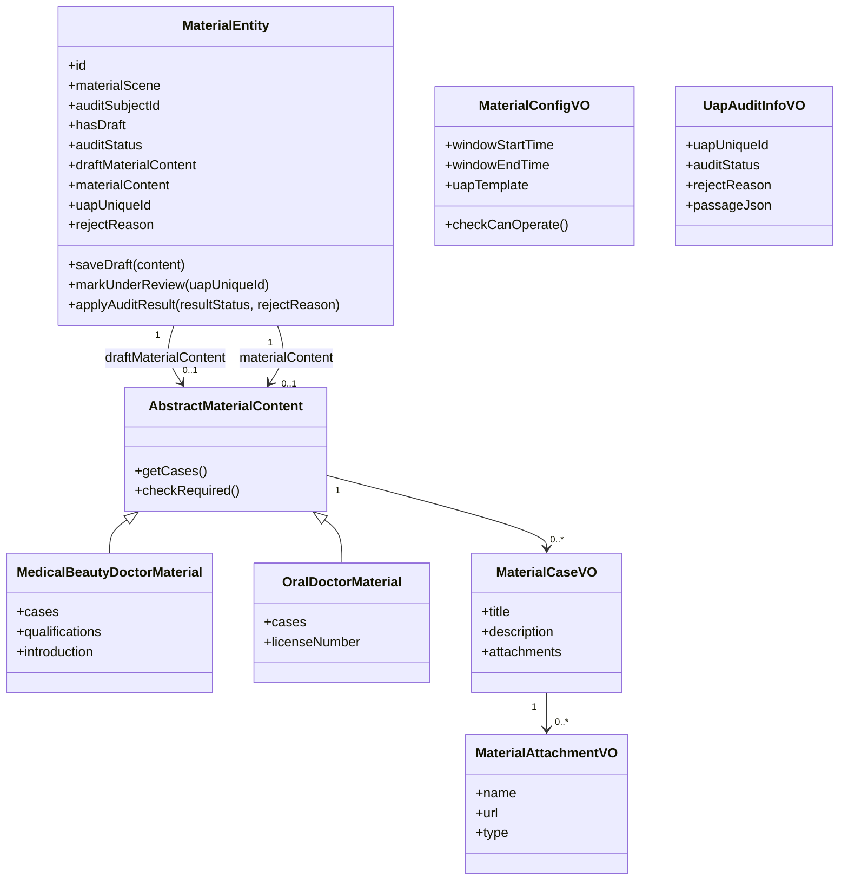
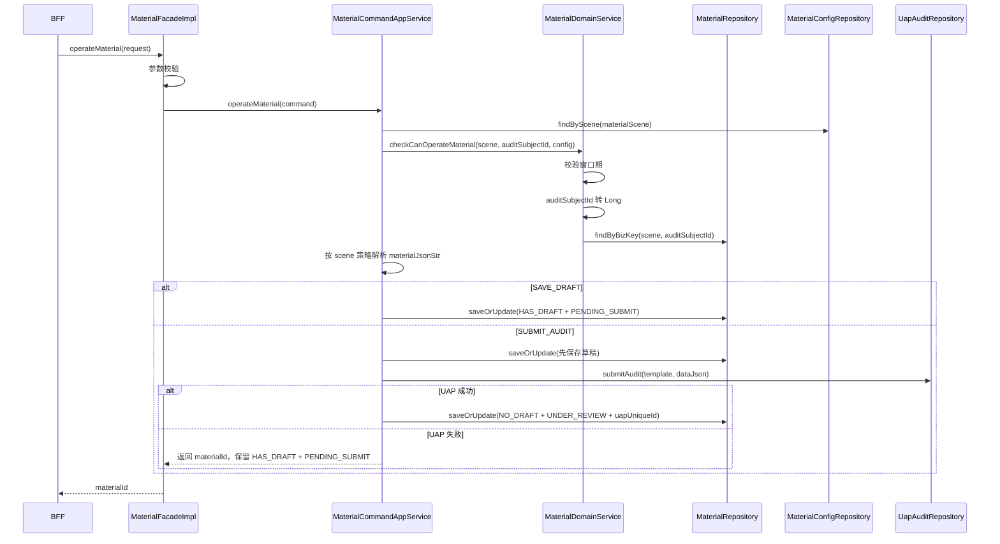
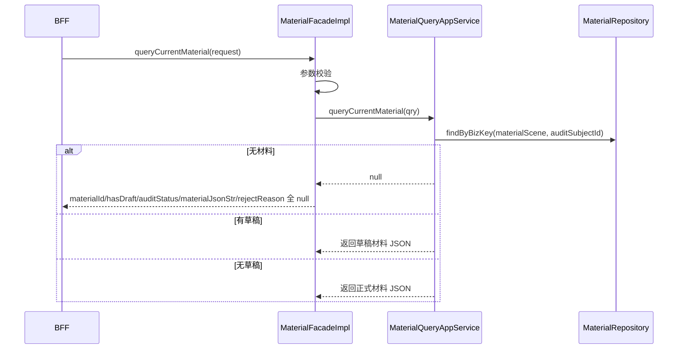
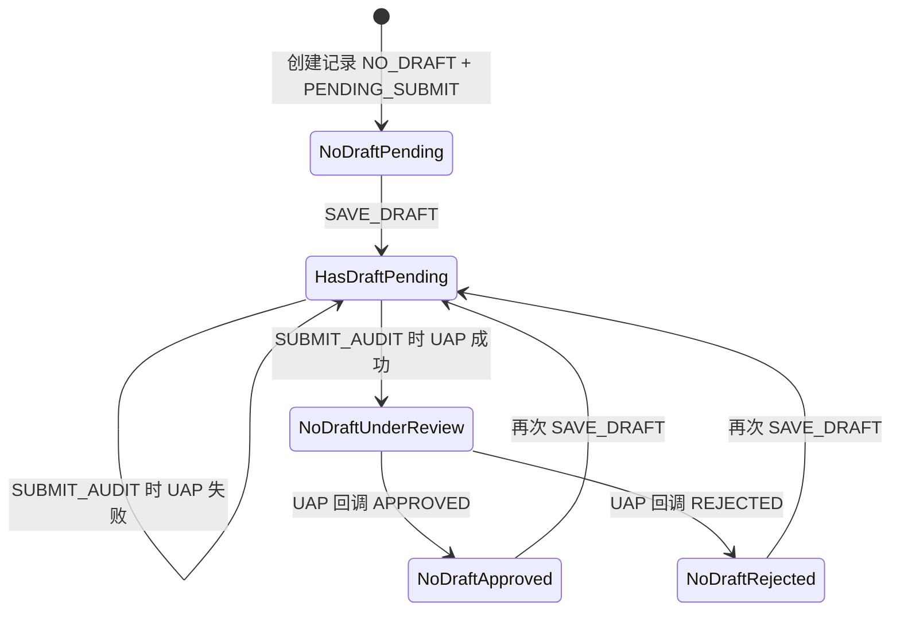

# 材料

## 领域边界

### 负责

- 管理司南榜医生榜材料提报，本期材料场景包括 `MEDICAL_BEAUTY_DOCTOR`（医美医生榜）和 `ORAL_DOCTOR`（口腔医生榜）。
- 以 `materialScene + auditSubjectId` 定位一条当前材料记录；当前 `auditSubjectId` 口径是医生 `techId` 字符串。
- 提供保存草稿、提交 UAP 审核、查询当前材料信息三类能力。
- 维护材料草稿内容、正式材料内容、草稿状态、审核状态、UAP 审核唯一标识和驳回原因。
- 按材料场景解析、校验材料内容，并构建 UAP 审核请求。
- 消费 UAP 审核结果 MQ 回调，将审核通过或驳回结果写回材料记录。
- 读取材料配置中的窗口期和 UAP 模板；当前基础设施实现为硬编码 mock，真实来源预期是 Lion。
- 在材料操作前做跨报名域校验：窗口期内，且材料主体应存在医生榜报名记录。

### 不负责

- 不负责报名记录、报名状态和报名资格本身，见 [sign/README.md](../sign/README.md)。
- 不负责 UAP 平台审核规则、审核人配置和审核页面；材料域只提交审核请求并接收回调结果。
- 不负责附件对象存储生命周期；材料内容只保存附件名称、URL、类型等引用信息。
- 不负责评审结论、模拟打分和报告透出，分别见 [review/README.md](../review/README.md)、[score/README.md](../score/README.md)、[report/README.md](../report/README.md)。

## 领域模型

| 对象 | 含义 | 关键规则 |
| --- | --- | --- |
| MaterialEntity | 单个主体在单个材料场景下的当前材料提报记录 | 业务键是 `materialScene + auditSubjectId`；实体内维护草稿、正式材料、UAP 标识和审核状态 |
| AbstractMaterialContent | 不同材料场景共享的抽象材料内容 | 子类必须提供案例/病例列表和送审必填校验 |
| MedicalBeautyDoctorMaterial | 医美医生榜材料内容 | 送审时至少 1 个案例，且必须有资质附件；个人简介当前不是必填 |
| OralDoctorMaterial | 口腔医生榜材料内容 | 送审时至少 1 个病例；`licenseNumber` 当前代码未做必填校验 |
| MaterialCaseVO | 案例/病例 | 包含标题、描述和附件列表 |
| MaterialAttachmentVO | 材料附件引用 | 只记录名称、URL、类型，不管理文件存储 |
| MaterialConfigVO | 材料配置 | 包含窗口期和 UAP 模板；操作前必须校验当前时间在窗口期内 |
| MaterialSceneStrategy | 场景策略 | 按场景负责 JSON 解析、必填校验、UAP 请求构建和当前材料 JSON 序列化 |
| UapAuditInfoVO | UAP 审核回调信息 | 回调按 `uapUniqueId` 找材料记录，只处理 `APPROVED` 和 `REJECTED` |

### 场景与内容口径

| 材料场景 | 中文含义 | auditSubjectId | 材料内容对象 | 送审必填 |
| --- | --- | --- | --- | --- |
| `MEDICAL_BEAUTY_DOCTOR` | 医美医生榜 | 医生 `techId` 字符串 | `MedicalBeautyDoctorMaterial` | `cases` 非空，`qualifications` 非空 |
| `ORAL_DOCTOR` | 口腔医生榜 | 医生 `techId` 字符串 | `OralDoctorMaterial` | `cases` 非空 |

### 操作口径

| 操作 | operationType | 规则 |
| --- | --- | --- |
| 保存草稿 | `SAVE_DRAFT` | 允许空材料、空 JSON 或 `{}`；写入草稿内容，状态变为 `HAS_DRAFT + PENDING_SUBMIT` |
| 提交审核 | `SUBMIT_AUDIT` | Facade 层拦截空材料、空 JSON 和 `{}`；通过场景策略校验必填后提交 UAP |
| 查询当前材料 | - | 无材料时响应字段全部为 `null`；有草稿优先返回草稿内容，无草稿返回正式材料内容；不返回历史版本 |

## 核心链路

### 保存草稿/提交审核

### 查询当前材料

## 持久化模型

| 数据 | Source of truth | 关键字段 | 说明 |
| --- | --- | --- | --- |
| 当前材料记录 | `t_material` | `id`, `material_scene`, `audit_subject_id`, `has_draft`, `audit_status`, `draft_material_json_str`, `material_json_str`, `uap_unique_id`, `reject_reason`, `created_time`, `updated_time` | 材料域核心表；`MaterialRepositoryImpl` 通过 `MaterialMapper.xml` 读写 |
| 草稿材料内容 | `t_material.draft_material_json_str` | JSON 字符串 | `has_draft = HAS_DRAFT` 时优先展示；保存草稿和送审前会写入 |
| 正式材料内容 | `t_material.material_json_str` | JSON 字符串 | UAP 提交成功后由草稿覆盖为正式材料 |
| 材料配置 | `MaterialConfigRepository` | `windowStartTime`, `windowEndTime`, `uapTemplate` | 当前 `MaterialConfigRepositoryImpl` 是 mock；医美/口腔窗口期均为 `2026-07-01 00:00:00` 到 `2026-12-31 23:59:59` |
| UAP 审核结果 | UAP MQ 回调 | `uapUniqueId`, `auditStatus`, `rejectReason`, `passageJson` | `UapAuditCallbackConsumer` 转成 `UapAuditInfoVO` 后交给应用服务处理 |

### 查询与写入方式

| 能力 | Repository/Mapper | 说明 |
| --- | --- | --- |
| 按业务键查当前材料 | `findByBizKey(materialScene, auditSubjectId)` / `selectByBizKey` | 用于保存、送审和查询当前材料 |
| 按 UAP 标识查材料 | `findByUapUniqueId(uapUniqueId)` / `selectByUapUniqueId` | 用于 UAP MQ 回调落状态 |
| 新增材料记录 | `insert(MaterialPO)` | `id` 为空时插入 `t_material` 并回填主键 |
| 更新材料记录 | `updateByBizKey(MaterialPO)` | 当前 SQL 实际按 `id` 更新，更新草稿、正式材料、审核状态、UAP 标识和驳回原因 |

## 状态机

材料状态由 `hasDraft` 和 `auditStatus` 两组字段共同表达。

| 状态字段 | 枚举值 | 含义 |
| --- | --- | --- |
| `hasDraft` | `NO_DRAFT` | 当前没有待提交草稿，查询返回正式材料 |
| `hasDraft` | `HAS_DRAFT` | 当前有草稿，查询优先返回草稿材料 |
| `auditStatus` | `PENDING_SUBMIT` | 待送审；保存草稿后进入该状态 |
| `auditStatus` | `UNDER_REVIEW` | UAP 提交成功，等待审核回调 |
| `auditStatus` | `APPROVED` | UAP 审核通过 |
| `auditStatus` | `REJECTED` | UAP 审核驳回，`rejectReason` 保存驳回原因 |

### UAP 回调规则

- 回调按 `uapUniqueId` 查找材料记录；找不到时只记录 error 日志并返回。
- 回调状态只接受 `APPROVED` 和 `REJECTED`；其他状态记录日志后忽略。
- 只有当前 `auditStatus = UNDER_REVIEW` 时才应用审核结果；非审核中状态按幂等回调忽略。
- `APPROVED` 和 `REJECTED` 都会写入 `auditStatus`；驳回时同时保存 `rejectReason`。
- `passageJson` 中的 `materialScene` 和 `auditSubjectId` 只做日志校验，不阻断回调处理。

## 领域隐形知识

- 本期材料提报只面向医生榜材料；报名域校验时 `signScene` 固定使用 `DOCTOR`。
- `auditSubjectId` 虽然是字符串入参，但材料域会转换为 Long 后查询报名域；非数字会直接报业务参数错误。
- 材料域目前不维护历史版本；查询只返回当前记录，且有草稿时优先返回草稿内容。
- 保存草稿不校验必填字段；送审才校验场景必填。
- UAP 调用异常或返回失败时，服务端保留 `HAS_DRAFT + PENDING_SUBMIT`，对调用方仍返回 `materialId`。
- `MaterialRepositoryImpl` 负责材料 JSON 和领域对象之间的解析；`MaterialConverter` 只做 PO/Entity 字段映射。
- `docs/tech-design/sinan-material.md` 写有“先调 UAP 再写库”，但当前代码路径是送审时先保存草稿，再调用 UAP，UAP 成功后再更新审核中状态。
- 当前 `UapAuditRepository` 只有领域接口，仓储实现未在源码中出现；真实 UAP RPC 接入位置需要补齐。
- 当前 `MaterialConfigRepositoryImpl` 是 mock 实现，不是真实 Lion 配置读取。
- 当前代码在报名域不可用时会记录 error 并放行材料操作；是否符合正式业务规则需要确认。

## 依赖关系

| 类型 | 对象 | 说明 |
| --- | --- | --- |
| 上游 | BFF | 本期暂无网关接入，BFF 拼接后调用 `MaterialFacade` |
| 上游 | sign | 材料操作前依赖医生榜报名记录和主体口径 |
| 上游 | MaterialConfigRepository/Lion | 提供材料提报窗口期和 UAP 模板；当前为 mock |
| 上游 | UAP | 送审时提交审核请求，成功后返回 `uapUniqueId` |
| 上游 | Mafka/UAP 回调 | 接收 UAP 审核结果并更新材料状态 |
| 下游 | review, score, report | 材料状态和内容可能影响后续评审、打分和报告透出；当前材料代码未直接触发这些链路 |

## 相关文档

- [sign/README.md](../sign/README.md)
- [review/README.md](../review/README.md)
- [score/README.md](../score/README.md)
- [report/README.md](../report/README.md)
- [workflows/商家报名材料驳回-workflow.md](../../workflows/商家报名材料驳回-workflow.md)
- [workflows/为什么我没有上榜-workflow.md](../../workflows/为什么我没有上榜-workflow.md)
- [docs/tech-design/sinan-material.md](../../../docs/tech-design/sinan-material.md)

## 待补充

- TODO: 补充 `t_material` 的真实 DDL、唯一索引和 `uap_unique_id` 索引定义。
- TODO: 补充真实 Lion 配置 key、配置结构、发布规则和不同材料场景的窗口期来源。
- TODO: 补充真实 UAP RPC 仓储实现、模板字段协议、透传字段格式和失败码处理规则。
- TODO: 需要业务确认 `UNDER_REVIEW` 状态下是否允许再次保存草稿；当前 `saveDraft()` 没有限制来源状态。
- TODO: 需要业务确认报名域不可用时是否允许放行材料保存/送审；当前代码是异常放行。
- TODO: 需要确认口腔医生榜 `licenseNumber` 是否应为送审必填字段；当前代码未强制校验。
- TODO: 补充附件上传/存储系统、URL 有效期和权限口径。
