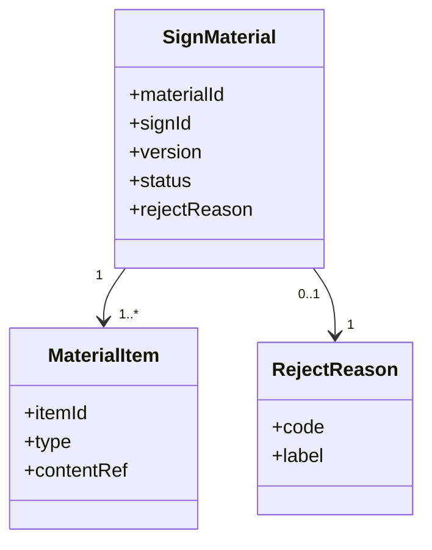
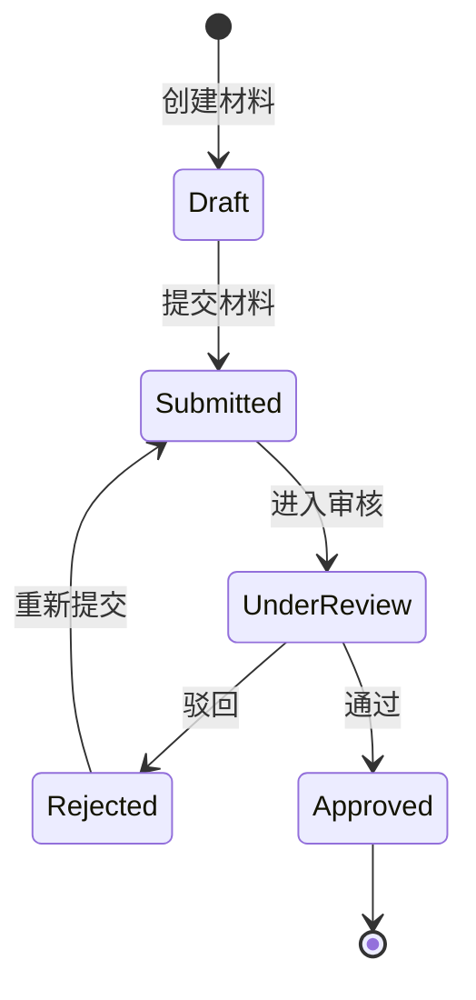

# 材料

## 领域边界

### 负责

- 管理商家报名后提交的材料、材料版本和材料状态。
- 支撑材料审核、驳回、补交、重新提交。
- 为评审和模拟打分提供材料输入。

### 不负责

- 不负责报名资格和报名记录本身，见 [sign/README.md](../sign/README.md)。
- 不负责评审结论，见 [review/README.md](../review/README.md)。
- 不负责报告透出，见 [report/README.md](../report/README.md)。

## 领域模型

| 对象 | 含义 | 关键规则 |
| --- | --- | --- |
| SignMaterial | 一次报名对应的材料集合 | TODO: 确认一条报名是否只有一个当前材料集合 |
| MaterialItem | 单项材料 | TODO: 补充材料类型枚举 |
| RejectReason | 驳回原因 | TODO: 确认驳回原因来源和是否允许自定义 |

## 持久化模型

| 数据 | Source of truth | 关键字段 | 说明 |
| --- | --- | --- | --- |
| 材料主记录 | TODO: 补充表/集合/API | materialId, signId, version, status | 记录材料当前版本和状态 |
| 材料明细 | TODO: 补充表/对象存储 | itemId, materialId, type, contentRef | 记录每项材料内容引用 |
| 驳回原因 | TODO: 补充配置/枚举来源 | code, label | 用于驳回材料时选择原因 |

## 状态机

> TODO: 以上状态机为初始占位，需要材料域负责人确认真实状态、版本规则和重新提交规则。

## 领域隐形知识

- 材料驳回后是否生成新材料版本需要确认；如果只是更新版本，应在持久化模型中写清楚。
- 驳回原因是否必须来自后台枚举需要确认；如果不能手填，应同步更新 [../workflows/商家报名材料驳回-workflow.md](../../workflows/商家报名材料驳回-workflow.md)。
- 材料重新提交后是否会重新触发评审或模拟打分需要确认。

## 依赖关系

| 类型 | 对象 | 说明 |
| --- | --- | --- |
| 上游 | sign | 材料依赖报名记录 |
| 下游 | review, score, report | 材料状态和内容可能影响评审、打分和报告透出 |

## 相关文档

- [../workflows/商家报名材料驳回-workflow.md](../../workflows/商家报名材料驳回-workflow.md)
- [../workflows/为什么我没有上榜-workflow.md](../../workflows/为什么我没有上榜-workflow.md)

## 待补充

- 真实材料类型枚举。
- 真实材料状态枚举。
- 驳回原因配置来源。
- 材料版本策略。
