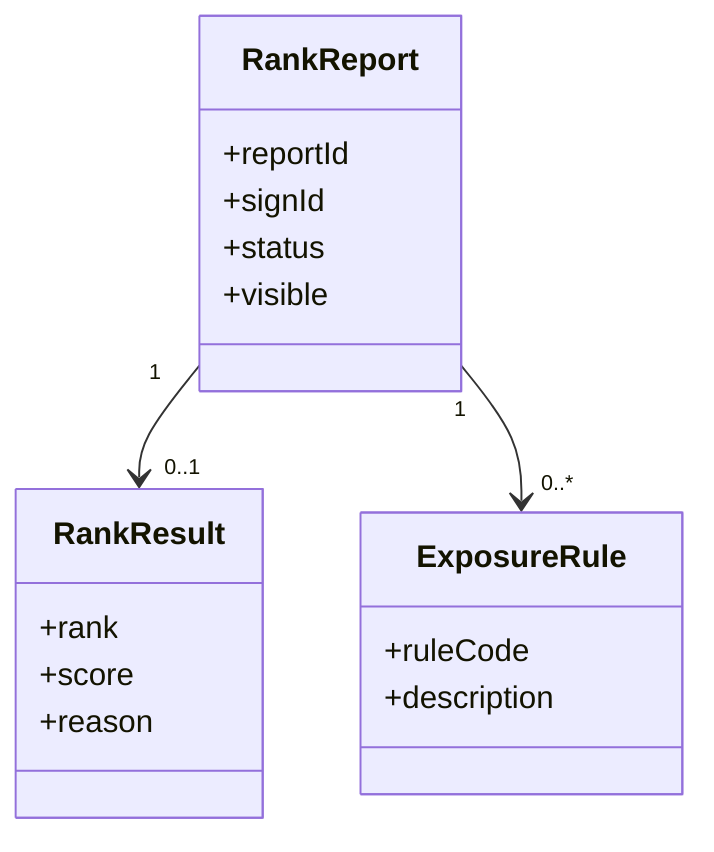
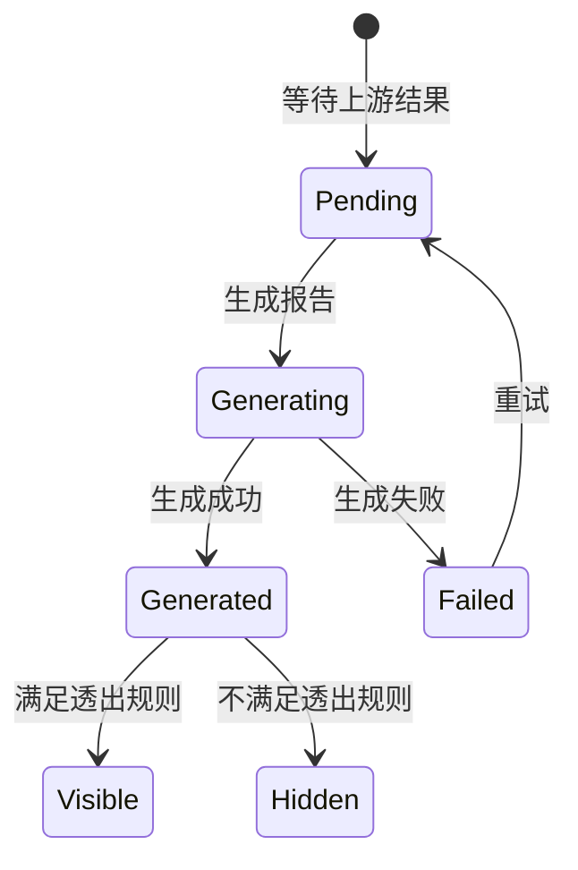

# 报告域

## 领域边界

### 负责

- 管理榜单结果、结果报告、榜单透出和未上榜解释。
- 汇总报名、材料、评审、模拟打分等上游结果。
- 为用户或运营提供可解释的结果展示。

### 不负责

- 不负责报名和材料事实的生产，见 [sign/README.md](../sign/README.md) 和 [material/README.md](../material/README.md)。
- 不负责评审结论生成，见 [review/README.md](../review/README.md)。
- 不负责评分计算，见 [score/README.md](../score/README.md)。

## 领域模型

| 对象 | 含义 | 关键规则 |
| --- | --- | --- |
| RankReport | 报告域主对象 | TODO: 补充报告生成条件 |
| RankResult | 榜单或结果数据 | TODO: 补充上榜、未上榜和排名口径 |
| ExposureRule | 透出规则 | TODO: 补充哪些条件会导致不透出 |

## 持久化模型

| 数据 | Source of truth | 关键字段 | 说明 |
| --- | --- | --- | --- |
| 报告主记录 | TODO: 补充表/集合/API | reportId, signId, status, visible | 报告域主数据 |
| 榜单结果 | TODO: 补充表/集合/API | reportId, rank, score, reason | 结果和解释 |
| 透出规则 | TODO: 补充配置/API | ruleCode, enabled | 决定报告是否展示 |

## 状态机

> TODO: 以上状态机为初始占位，需要报告域负责人确认真实状态、可见性和重试策略。

## 领域隐形知识

- “未上榜”不一定等于没有报名；可能发生在材料、评审、评分或透出任一环节。
- 报告域应优先解释“结果为什么这样展示”，不要反向篡改上游事实。
- TODO: 补充榜单落地页和结果报告之间的真实关系。
- TODO: 补充用户看到的文案与内部状态之间的映射。

## 依赖关系

| 类型 | 对象 | 说明 |
| --- | --- | --- |
| 上游 | sign | 判断是否存在有效报名 |
| 上游 | material | 判断材料是否完整、通过或被驳回 |
| 上游 | review | 判断评审是否通过 |
| 上游 | score | 判断分数、候选资格和结果解释 |
| 下游 | 榜单落地页/结果页 | 展示报告和结果解释 |

## 相关文档

- [../workflows/为什么我没有上榜-workflow.md](../../workflows/为什么我没有上榜-workflow.md)
- [../spec-prds/report-结果页透出-20260623.md](../../spec-prds/report-结果页透出-20260623.md)
- [../adr/引入报告域模型.md](../../adr/引入报告域模型.md)

## 待补充

- 报告生成条件。
- 报告状态真实枚举。
- 透出规则来源。
- 未上榜原因映射表。
