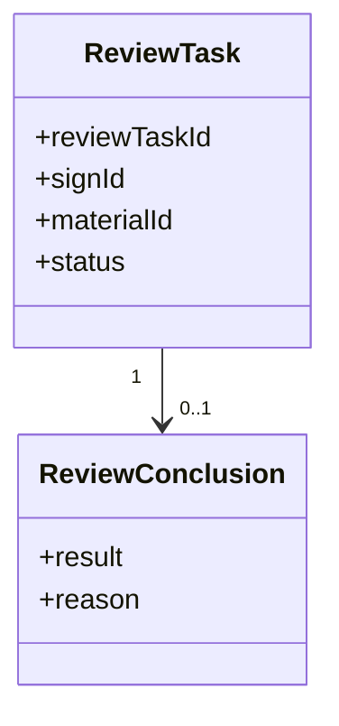
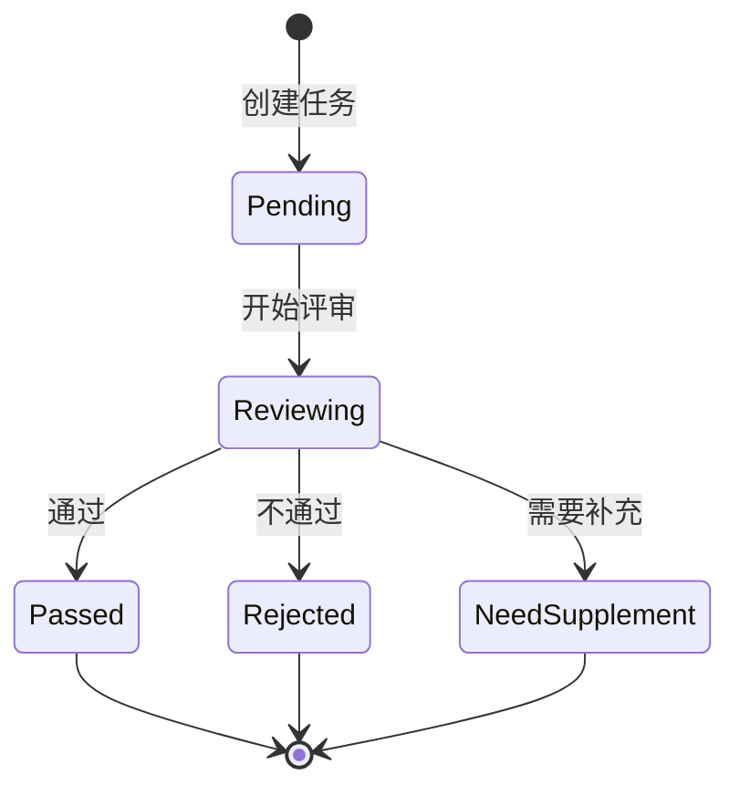

# 评审

## 领域边界

### 负责

- 管理报名材料进入评审后的评审任务、评审结论和评审状态。
- 输出是否进入后续模拟打分或报告生成的判断依据。

### 不负责

- 不负责材料提交和驳回，见 [material/README.md](../material/README.md)。
- 不负责评分计算，见 [score/README.md](../score/README.md)。
- 不负责最终结果透出，见 [report/README.md](../report/README.md)。

## 领域模型

| 对象 | 含义 | 关键规则 |
| --- | --- | --- |
| ReviewTask | 一次评审任务 | TODO: 补充任务生成时机 |
| ReviewConclusion | 评审结论 | TODO: 补充结论枚举和业务含义 |

## 持久化模型

| 数据 | Source of truth | 关键字段 | 说明 |
| --- | --- | --- | --- |
| 评审任务 | TODO: 补充表/集合/API | reviewTaskId, signId, materialId, status | 评审过程的主记录 |
| 评审结论 | TODO: 补充表/集合/API | reviewTaskId, result, reason | 评审输出 |

## 状态机

> TODO: 以上状态机为初始占位，需要评审域负责人确认真实状态和流转。

## 领域隐形知识

- TODO: 补充评审结论与材料驳回、补交之间的关系。
- TODO: 补充评审通过是否一定进入模拟打分。
- TODO: 补充评审失败是否会直接导致未上榜。

## 依赖关系

| 类型 | 对象 | 说明 |
| --- | --- | --- |
| 上游 | material | 评审依赖材料内容和材料状态 |
| 下游 | score, report | 评审结论可能影响评分和报告透出 |

## 相关文档

- [../workflows/为什么我没有上榜-workflow.md](../../workflows/为什么我没有上榜-workflow.md)

## 待补充

- 评审任务生成条件。
- 评审结论枚举。
- 评审失败和未上榜的关系。
