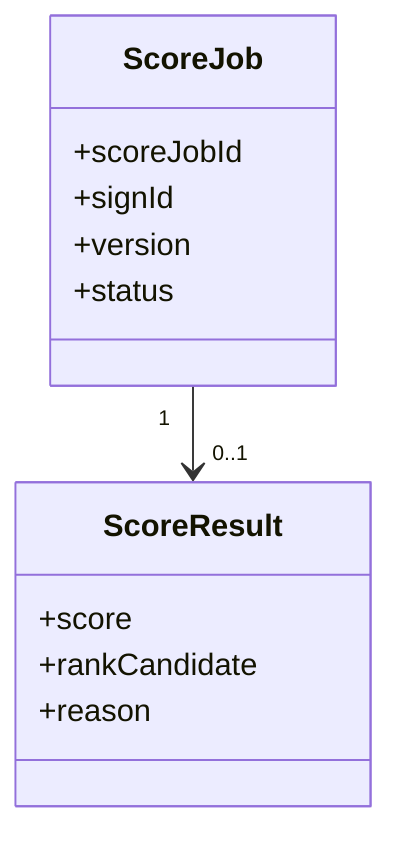
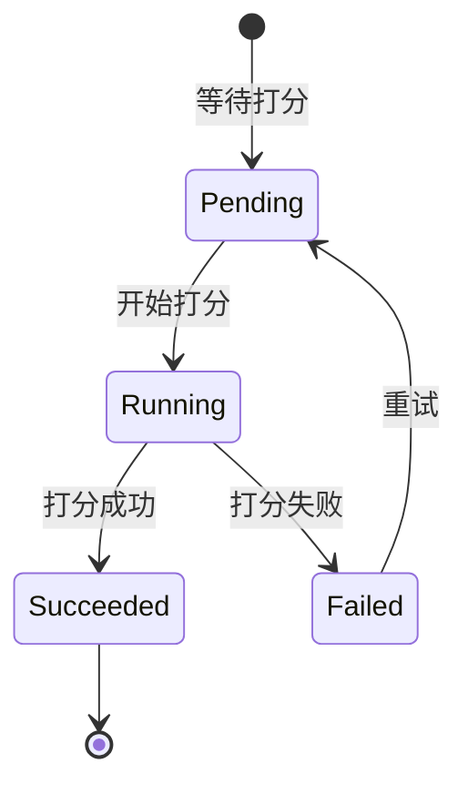

# 模拟打分

## 领域边界

### 负责

- 根据报名、材料和评审输入生成模拟分数或评分结果。
- 记录评分输入、评分版本、评分结果和评分失败原因。
- 为报告域提供结果解释或榜单候选依据。

### 不负责

- 不负责材料审核，见 [review/README.md](../review/README.md)。
- 不负责榜单透出和报告展示，见 [report/README.md](../report/README.md)。

## 领域模型

| 对象 | 含义 | 关键规则 |
| --- | --- | --- |
| ScoreJob | 一次模拟打分任务 | TODO: 补充触发条件 |
| ScoreResult | 打分输出 | TODO: 补充分数口径和候选判断 |

## 持久化模型

| 数据 | Source of truth | 关键字段 | 说明 |
| --- | --- | --- | --- |
| 打分任务 | TODO: 补充表/集合/API | scoreJobId, signId, version, status | 记录评分任务 |
| 打分结果 | TODO: 补充表/集合/API | scoreJobId, score, rankCandidate, reason | 记录评分输出 |

## 状态机

> TODO: 以上状态机为初始占位，需要模拟打分负责人确认真实任务状态和重试规则。

## 领域隐形知识

- TODO: 补充评分版本变化是否影响历史报告。
- TODO: 补充打分失败时报告域如何展示。
- TODO: 补充分数与榜单候选、未上榜原因之间的关系。

## 依赖关系

| 类型 | 对象 | 说明 |
| --- | --- | --- |
| 上游 | sign, material, review | 打分依赖报名、材料和评审输入 |
| 下游 | report | 报告域依赖评分结果和解释 |

## 相关文档

- [../workflows/为什么我没有上榜-workflow.md](../../workflows/为什么我没有上榜-workflow.md)

## 待补充

- 评分触发条件。
- 评分输入字段。
- 评分版本策略。
- 评分失败兜底策略。
