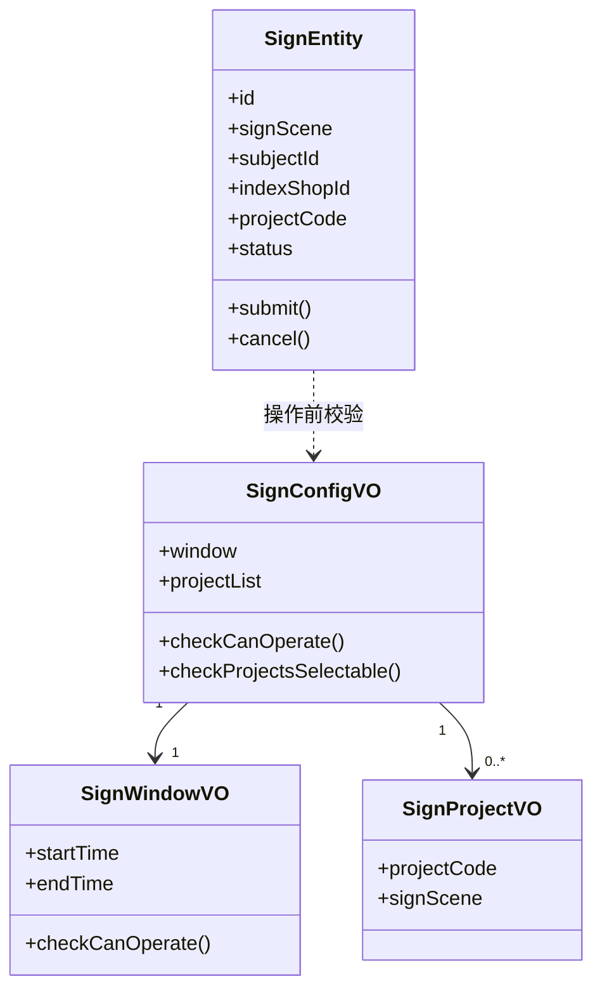
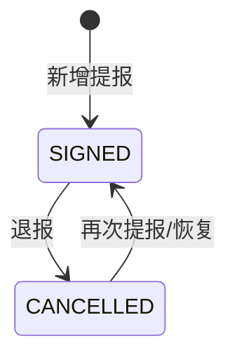

# 报名

## 领域边界

### 负责

- 管理司南榜报名入口，支持机构榜和医生榜两个报名场景。
- 承接 BFF 拼接后的 Facade 调用，提供提报、退报、报名分页查询、可选提报项目查询、机构医生列表查询能力。
- 记录报名主体在某个报名场景下对单个提报项目的报名状态。
- 校验报名窗口期、可选提报项目、单主体项目数上限和医生榜机构医生数上限。
- 为材料、评审、模拟打分、报告域提供报名基础记录和报名状态。

### 不负责

- 不负责报名材料内容本身，材料进入 [material/README.md](../material/README.md)。
- 不负责评审结论，评审进入 [review/README.md](../review/README.md)。
- 不负责最终榜单透出或结果报告，报告进入 [report/README.md](../report/README.md)。
- 不负责真实医生主数据维护；当前通过 `DoctorAcl` 查询机构医生列表，基础设施实现仍是占位数据。
- 不负责真实报名配置平台维护；当前 `SignConfigRepositoryImpl` 是硬编码 mock，代码注释说明真实接入 Lion 时替换。

## 领域模型

| 对象 | 含义 | 关键规则 |
| --- | --- | --- |
| SignEntity | 一个报名主体在一个报名场景下对一个提报项目的报名记录 | 一个记录只对应一个 `signScene`、一个 `subjectId`、一个 `projectCode`；状态只在 `SIGNED` 和 `CANCELLED` 间流转 |
| SignConfigVO | 报名配置值对象 | 操作前必须校验窗口期和项目可选性；配置缺失时不能提报或退报 |
| SignWindowVO | 报名窗口期 | `startTime`、`endTime` 必须同时存在；当前时间不在窗口期内时不能提报或退报 |
| SignProjectVO | 可选提报项目 | 用 `projectCode` 表示可选项目，按 `signScene` 区分机构榜和医生榜 |
| DoctorAcl.DoctorDTO | 机构医生信息 | 用于医生榜报名选择医生；当前实现是占位 mock，真实外部服务待替换 |

### 场景与主体口径

| 场景 | API 入参编码 | Domain/DB 存储值 | subjectId 口径 | indexShopId 口径 |
| --- | --- | --- | --- | --- |
| 机构榜 | `1` | `INSTITUTION` | 机构 `shopId` | 机构 `shopId` |
| 医生榜 | `2` | `DOCTOR` | 医生 `techId` | 医生所属机构 `shopId` |

### 操作口径

| 操作 | operationType | 规则 |
| --- | --- | --- |
| 提报 | `SUBMIT` | 只处理不存在或已退报的项目；已提报项目会跳过 |
| 退报 | `CANCEL` | 只处理当前已提报的项目；不存在或已退报项目会跳过 |

### 数量限制

| 限制项 | 当前代码规则 |
| --- | --- |
| 单次操作项目数 | Facade 层限制一次最多操作 2 个 `projectCode` |
| 单主体已提报项目数 | 提报后同一主体最多有 2 个 `SIGNED` 项目 |
| 医生榜机构医生数 | 医生榜新增医生报名时，同一机构最多 10 个已报名医生 |

## 持久化模型

| 数据 | Source of truth | 关键字段 | 说明 |
| --- | --- | --- | --- |
| 报名记录 | `t_sign` | `id`, `sign_scene`, `subject_id`, `index_shop_id`, `project_code`, `status`, `created_time`, `updated_time` | 报名域核心表；`SignEntity` 通过 `SignConverter` 和 `SignPO` 双向转换 |
| 报名配置 | `SignConfigRepository` | `signScene`, `window`, `projectList` | 领域接口说明读取 Lion 配置；当前基础设施实现为硬编码 mock |
| 机构医生列表 | `DoctorAcl` | `shopId`, `includeOffline`, `techId`, `doctorName`, `onlineStatus` | 防腐层接口；当前基础设施实现为硬编码 mock |

### 查询与写入方式

| 能力 | Repository/Mapper | 说明 |
| --- | --- | --- |
| 按场景和主体查报名记录 | `queryBySceneSubject(signScene, subjectId)` | 提报/退报前用于构建当前主体的项目报名映射 |
| 统计医生榜机构已报名医生数 | `countSignedDoctorsByIndexShopId(signScene, indexShopId)` | SQL 按 `status = 'SIGNED'` 统计 `DISTINCT subject_id` |
| 新增报名记录 | `insert(SignPO)` | 主键为空时插入 `t_sign`，回填自增 `id` |
| 更新报名状态 | `updateStatus(SignPO)` | 已有主键时只更新 `status` 和 `updated_time` |
| 机构维度分页查询报名记录 | `queryShopSignPage(signScene, indexShopId, status, offset, limit)` | 按 `updated_time DESC` 排序；`status` 为空时查全部 |

## 状态机

- 当前代码只有 `SIGNED` 和 `CANCELLED` 两个报名状态。
- `submit()` 对已 `SIGNED` 的记录幂等返回；否则把状态改为 `SIGNED`。
- `cancel()` 对已 `CANCELLED` 的记录幂等返回；否则把状态改为 `CANCELLED`。
- 没有独立 `Draft`、`Submitted`、`Expired` 状态；窗口期外不能操作由 `SignWindowVO` 在操作前校验。

## 领域隐形知识

- 报名记录粒度是“主体 + 场景 + 提报项目”，不是“主体 + 活动”或“主体 + 批次”。
- API 层 `signScene` 用数字编码，领域层和数据库使用枚举名字符串；转换在 `SignAssembler` 完成。
- `shopId` 在操作接口中始终必传：机构榜时等于报名主体，医生榜时是医生所属机构，并冗余到 `indexShopId`。
- 提报不是全量覆盖：请求里的项目中，只有不存在或已退报的项目会新增或恢复；已提报项目不会重复写。
- 退报不是物理删除：只把状态更新为 `CANCELLED`。
- 当前可选项目和窗口期来自 mock 配置：机构榜项目为 `101/102/103`，医生榜项目为 `101/102`，窗口期为 `2026-07-01 00:00:00` 到 `2026-12-31 23:59:59`。真实 Lion 配置接入后这里需要同步更新。
- 分页查询按机构维度查 `indexShopId`，可选按状态筛选；状态入参 `1` 转 `SIGNED`，`2` 转 `CANCELLED`，其他值按空状态处理。
- 仓储层部分查询异常会记录 error 并返回空结果或 0；保存异常会继续抛出。

## 依赖关系

| 类型 | 对象 | 说明 |
| --- | --- | --- |
| 上游 | BFF | 本期暂无网关接入，BFF 方拼接后调用报名 Facade |
| 上游 | SignConfigRepository/Lion | 提供报名窗口期和可选提报项目配置；当前实现为 mock |
| 上游 | DoctorAcl | 提供机构医生列表；当前实现为 mock |
| 下游 | material, review, score, report | 后续链路依赖报名记录、报名主体和报名状态 |

## 相关文档

- [workflows/商家报名材料驳回-workflow.md](../../workflows/商家报名材料驳回-workflow.md)
- [workflows/为什么我没有上榜-workflow.md](../../workflows/为什么我没有上榜-workflow.md)

## 待补充

- TODO: 补充真实 Lion 配置 key、配置平台位置、配置发布规则和字段结构。
- TODO: 补充真实医生服务来源、接口协议、离线医生口径和异常兜底规则。
- TODO: 需要报名域负责人确认报名成功与材料提交、评审、打分、报告之间是否存在强约束或异步触发关系。
- TODO: 需要业务确认是否存在报名资格判断；当前代码只校验窗口期、可选项目和数量限制，没有独立资格模型。
