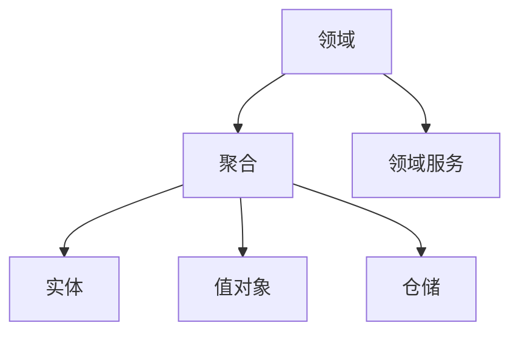

# DDD 概念说明

这篇文档只做概念说明，不作为强制编码规范。

## 核心概念

| 概念 | 说明 |
| --- | --- |
| 领域 | 一组稳定业务问题和规则的边界，例如报名、材料、评审、模拟打分、报告域 |
| 实体 | 有唯一身份且生命周期会变化的对象，例如一条报名记录 |
| 值对象 | 没有独立身份、通过值表达含义的对象，例如驳回原因、分数区间 |
| 聚合 | 一组需要保持一致性的对象边界 |
| 领域服务 | 不自然属于单个实体，但属于领域规则的行为 |
| 仓储 | 领域对象和持久化模型之间的访问边界 |

## 概念关系

## 代码中的表现

- 领域模型表达业务规则，不直接等同于数据库表。
- 持久化模型表达数据如何存储，不应反向决定业务语言。
- 状态机适合表达领域对象生命周期。

## 常见误区

- 把数据库表直接当领域模型。
- 只写 CRUD，不表达业务规则。
- 把所有逻辑都塞进 service，领域对象只剩字段。
- 没有记录领域隐形知识，导致新人只能从代码猜规则。

## 领域文档如何使用这些概念

领域文档需要写领域边界、领域模型、持久化模型、状态机和领域隐形知识；具体结构见 [domain-template.md](../templates/domain-template.md)。领域模型回答“业务上是什么”，持久化模型回答“数据在哪里”，状态机回答“怎么流转”。
