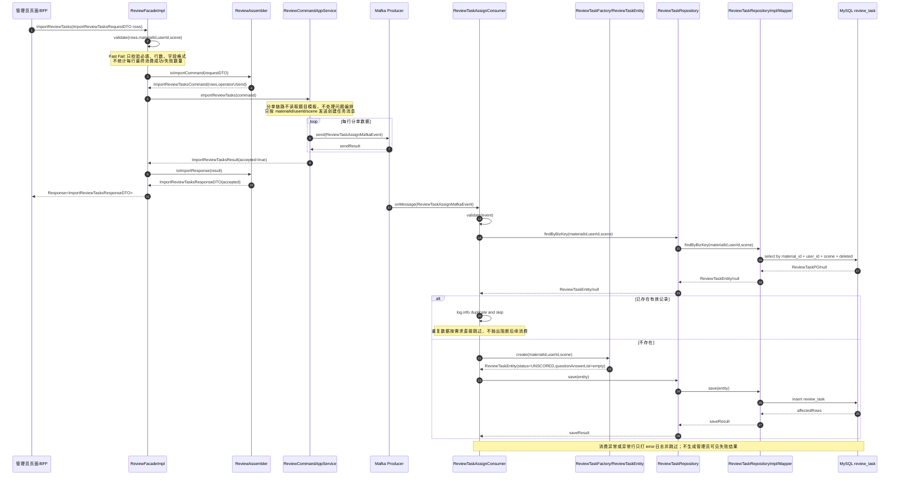
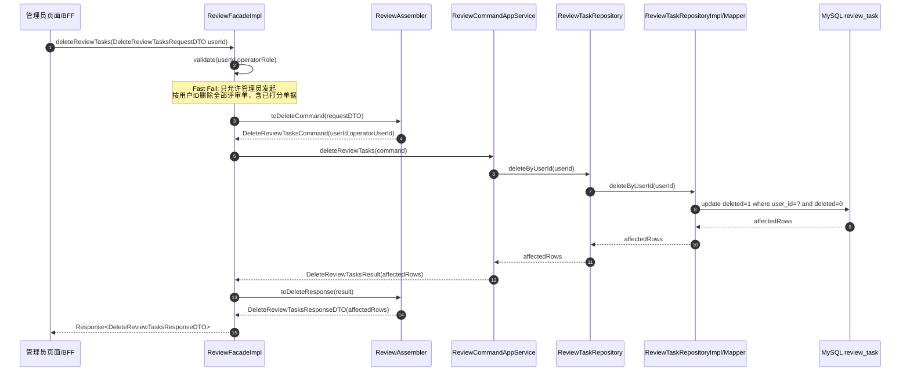
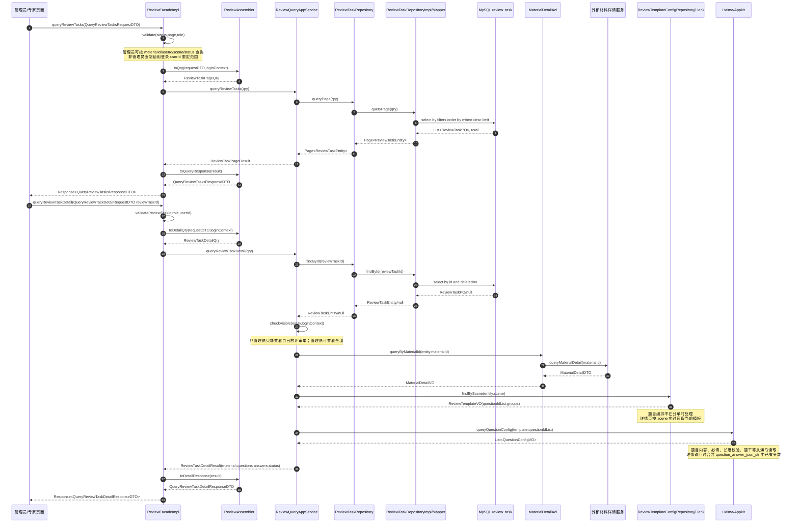
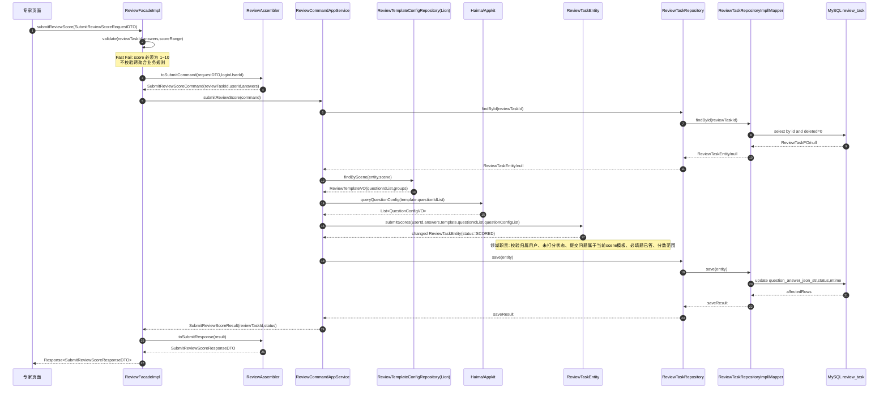
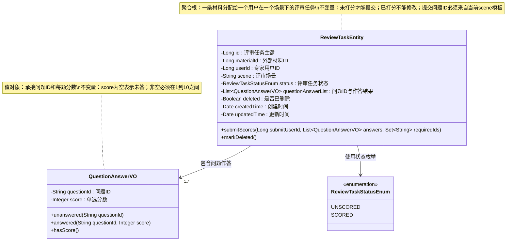
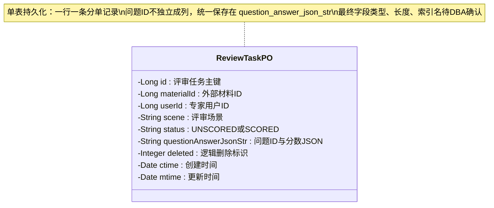

# 评审系统技术方案

## 0. 目标澄清

### 已确认目标

- 为评审域提供分单、删单、已打分/未打分列表、详情页和提交打分能力。
- 管理员通过分单入口导入材料 ID、用户 ID、场景，系统异步创建评审单。
- 管理员和非管理员共用同一个列表接口，通过角色和登录用户上下文控制可见范围。
- 专家进入详情页时，材料详情实时查询外部材料系统；评审系统只持有材料 ID。
- 分单记录本身不处理问题编排；专家提交打分后，问题 ID 与作答结果统一保存在 `question_answer_json_str`。

### 已确认边界

- 本期不维护材料聚合完整生命周期。
- 本期不处理点评账号与外部专家身份绑定，默认上游账号体系能识别用户 ID。
- 本期不支持重新打分或修改评分。
- 本期不做分单失败补偿、失败任务管理或管理员导入结果统计。
- 本期不做复核、申诉、导出报表、评分统计、专家绩效。
- 本期不需要灰度开关。

### 已确认入口

- 对外入口按 `rank-api` 的 `ReviewFacade` 扩展。
- 当前仓库是 `rank-api`、`rank-application`、`rank-domain`、`rank-infrastructure` 四层骨架，暂无独立 adapter 模块；FacadeImpl/Consumer 按 Adapter 职责描述。
- MQ Consumer 是分单真正落库入口。

### 已确认接口拆分

1. `ReviewFacade#importReviewTasks`：分单。
2. `ReviewFacade#deleteReviewTasks`：删单。
3. `ReviewFacade#queryReviewTasks`：已打分/未打分列表，管理员和非管理员共用。
4. `ReviewFacade#queryReviewTaskDetail`：详情页。
5. `ReviewFacade#submitReviewScore`：提交打分。

每个接口都需要独立接口文档。

### 已确认成功标准

- 分单后 MQ 消费能创建评审单，一行 Excel 数据对应一条分单记录。
- 同一个 `material_id + user_id + scene` 只存在一条有效评审单。
- 分单只创建评审任务主记录，不解析题目编排；详情页和提交打分时按 `scene` 读取当前题目模板和题目配置。
- 专家提交每题 `1~10` 单选分后，评审单状态变为已打分。
- 管理员按用户 ID 删除该用户全部评审单，已打分单据也允许删除。
- 列表接口能区分已打分/未打分，并按管理员/非管理员身份控制数据范围。

## 0.1 方案锚点

### 当前理解

- 评审域核心聚合是 `ReviewTaskEntity`，表示一次"材料 + 用户 + 场景"的评审任务。
- 材料是外部聚合根，评审表只保存 `materialId`。
- 用户 ID 表示专家用户，不再使用 `expertAccount` 命名。
- 场景字段使用 `scene`，不使用 `submitProject`。
- 问题不做 MySQL 独立列；`question_answer_json_str` 初始为空数组，提交打分后保存问题 ID 和每题分数。

### 核心目标

- 用一张评审单表承接任务状态、材料引用、用户引用、场景和问题作答 JSON。
- 用 MQ 承接大批量分单削峰，消费失败或重复数据只打日志跳过。
- 用海马维护问题内容，用配置中心/Lion 维护场景到问题编排的映射，读取发生在详情页和提交打分链路。
- 用领域模型收口未打分到已打分、删除、分数校验和当前模板问题集合校验。

### 范围边界

- 包含：Facade 接口、Command/Qry、Application 编排、ReviewTaskEntity、QuestionAnswerVO、ReviewTaskRepository、ReviewTaskPO/Converter/Mapper、详情/打分链路的海马问题读取与 Lion 模板读取、Mafka 分单消费、测试用例。
- 不包含：账号绑定、材料写入、重新打分、评分统计、缓存、灰度开关、失败补偿后台。

### 完成标准

- 方案能指导研发完成 5 个 Facade 接口、1 个 MQ Consumer 和 1 个评审单聚合。
- 方案能指导 DBA/研发基于已确认字段补齐 MySQL 表结构和索引评审。
- 方案能让测试按接口、MQ、海马异常、重复分单和打分状态流转构造用例。

### 待确认问题

- 外部材料详情查询的真实接口只确认"按材料 ID 实时查询"，当前类名、方法名、返回字段待补充。
- MySQL 表名、字段类型、字段长度、索引名、迁移脚本和 DBA 结论待补充。
- Mafka topic、consumer group、限流参数待补充。
- 海马 sceneKey、Lion key 和问题配置字段 key 待补充。

## 0.2 设计维度判定

| 维度 | 是否涉及 | 判断依据 | 是否展开 |
|---|---|---|---|
| DB 变更 | 是 | 用户确认一张 MySQL 表，一行是一条分单记录 | 是；不输出最终 DDL |
| 海马/Appkit 配置 | 是 | 用户确认问题维护在海马 | 是 |
| Cellar / 缓存 | 否 | 用户确认材料详情实时查询，未要求缓存；题目配置也不做缓存 | 否 |
| Mafka / MQ 消息 | 是 | 用户确认分单先发 MQ，消费时真正分单 | 是 |
| Lion 开关 / 配置 | 是 | 题目模板编排放配置中心/Lion | 是 |
| 灰度和回滚 | 否 | 用户确认不需要灰度 | 仅说明上线和回滚边界 |
| 接口文档 | 是 | 用户确认接口拆分 | 是 |
| 外部 RPC / HTTP | 是 | 详情页实时查询材料详情 | 是；真实接口待补充 |
| 真实调用代码 | 部分涉及 | 材料详情真实接口待补充，只给 ACL 代码骨架 | 轻量展开 |
| 测试用例与测试代码 | 是 | 需要覆盖 Facade、MQ、领域逻辑和外部依赖异常 | 是 |
| 接口拆分 | 是 | 用户确认分单、删单、列表、详情页，并补充打分接口 | 是 |
| Entity 设计 | 是 | `ReviewTaskEntity` 是核心聚合根 | 是 |
| MySQL 表结构用户输入 | 部分提供 | 已确认字段语义和唯一性，未提供类型/长度/DDL | 基于输入整理，不生成 DDL |

## 0.3 用户输入确认

| 输入项 | 用户是否已提供 | 说明 |
|---|---|---|
| 核心目标与成功标准 | 是 | 分单、删单、列表、详情、打分 |
| 入口与调用方 | 是 | `ReviewFacade`、Mafka Consumer |
| 接口拆分清单 | 是 | 5 个 Facade 接口 |
| 每个接口的接口文档要求 | 是 | 都需要 |
| Entity/VO 设计输入 | 是 | 分单记录、用户 ID、材料 ID、场景、状态、问题作答 JSON |
| MySQL 表结构 | 部分提供 | 用户确认无问题 ID 字段；缺类型、长度、索引名 |
| 中间件与外部依赖 | 是 | MySQL、Mafka、海马、Lion、材料详情外部查询 |
| 测试、灰度、回滚要求 | 部分提供 | 不需要灰度；测试用例由方案给出 |

## 1. 背景与目标

### 1.1 业务背景

评审系统用于把运营指定的材料分配给外部专家，由专家按场景配置的问题完成 `1~10` 单选打分。题目由海马维护，题目出现位置和分组由模板编排，研发不应因为题目内容调整频繁发版。

### 1.2 本次目标

- 管理员可以批量分单，系统异步创建评审任务。
- 管理员可以按用户 ID 删除该用户全部评审任务。
- 管理员和专家共用列表接口查询已打分/未打分记录。
- 专家可以查看详情页，实时获取材料详情和题目内容。
- 专家可以一次性提交所有问题分数，评审任务状态变为已打分。

### 1.3 非目标

- 不维护材料数据本身。
- 不维护专家账号绑定关系。
- 不支持评分修改。
- 不做分单导入成功/失败数量展示。
- 不做缓存、灰度开关、失败补偿后台。

### 1.4 上下游

- 上游：管理员页面、专家页面或 BFF。
- 下游：MySQL 评审单表、Mafka、海马/Appkit、Lion/配置中心、材料详情外部服务。

## 2. 调用链与分层职责

### 2.1 分单调用链



### 2.2 删单调用链



### 2.3 列表与详情调用链



### 2.4 提交打分调用链



## 3. 领域模型

### 3.1 Entity / VO 设计

```java
package com.rank.domain.review.model;

import com.rank.domain.common.exception.BizException;
import com.rank.domain.review.shared.ReviewTaskStatusEnum;
import lombok.Getter;

import java.util.ArrayList;
import java.util.Date;
import java.util.HashSet;
import java.util.List;
import java.util.Set;

/**
 * 聚合职责：维护一条材料评审任务的分配、作答和删除状态。
 * 核心不变量：
 * 1. 一条有效评审任务只对应一个 materialId、一个 userId、一个 scene。
 * 2. 未打分状态才能提交打分；已打分后不允许重新提交或修改。
 * 3. 专家提交的 questionId 必须来自提交时当前 scene 的问题模板。
 */
@Getter
public class ReviewTaskEntity {

    /** 评审任务主键 */
    private Long id;
    /** 外部材料ID */
    private Long materialId;
    /** 专家用户ID */
    private Long userId;
    /** 评审场景 */
    private String scene;
    /** 评审任务状态 */
    private ReviewTaskStatusEnum status;
    /** 问题ID与专家作答结果 */
    private List<QuestionAnswerVO> questionAnswerList;
    /** 是否已删除 */
    private Boolean deleted;
    /** 创建时间 */
    private Date createdTime;
    /** 更新时间 */
    private Date updatedTime;

    public ReviewTaskEntity(Long materialId, Long userId, String scene) {
        this.materialId = materialId;
        this.userId = userId;
        this.scene = scene;
        this.status = ReviewTaskStatusEnum.UNSCORED;
        this.questionAnswerList = new ArrayList<QuestionAnswerVO>();
        this.deleted = Boolean.FALSE;
        this.createdTime = new Date();
        this.updatedTime = new Date();
    }

    /**
     * @param submitUserId 提交打分的用户ID
     * @param answers      本次提交的每题分数
     * @param allowedIds   当前scene模板中的问题ID集合
     * @param requiredIds  海马配置中必答的问题ID集合
     * @return 无返回值；副作用：写入每题分数并将任务状态变更为已打分
     */
    public void submitScores(Long submitUserId, List<QuestionAnswerVO> answers,
                             Set<String> allowedIds, Set<String> requiredIds) {
        if (!this.userId.equals(submitUserId)) {
            throw BizException.forbidden("无权提交该评审任务");
        }
        if (!ReviewTaskStatusEnum.UNSCORED.equals(this.status)) {
            throw BizException.illegalState("评审任务已打分，不能重复提交");
        }
        validateQuestionScope(answers, allowedIds);
        validateRequiredAnswered(answers, requiredIds);
        this.questionAnswerList = answers;
        this.status = ReviewTaskStatusEnum.SCORED;
        this.updatedTime = new Date();
    }

    /**
     * @return 无返回值；副作用：逻辑删除评审任务
     */
    public void markDeleted() {
        this.deleted = Boolean.TRUE;
        this.updatedTime = new Date();
    }

    private void validateQuestionScope(List<QuestionAnswerVO> answers, Set<String> allowedIds) {
        for (QuestionAnswerVO answer : answers) {
            if (!allowedIds.contains(answer.getQuestionId())) {
                throw BizException.invalidParam("提交了当前场景模板外的问题");
            }
        }
    }

    private void validateRequiredAnswered(List<QuestionAnswerVO> answers, Set<String> requiredIds) {
        Set<String> answeredIds = new HashSet<String>();
        for (QuestionAnswerVO answer : answers) {
            if (answer.hasScore()) {
                answeredIds.add(answer.getQuestionId());
            }
        }
        for (String requiredId : requiredIds) {
            if (!answeredIds.contains(requiredId)) {
                throw BizException.invalidParam("必答问题未完成");
            }
        }
    }
}
```

```java
package com.rank.domain.review.model;

import com.rank.domain.common.exception.BizException;
import lombok.Getter;

/**
 * 值对象职责：表示一个问题ID及专家对该问题的单选打分结果。
 * 核心不变量：score 为空表示未作答；非空时必须在 1~10 范围内。
 */
@Getter
public class QuestionAnswerVO {

    /** 问题ID */
    private final String questionId;
    /** 单选分数，范围1~10 */
    private final Integer score;

    private QuestionAnswerVO(String questionId, Integer score) {
        if (questionId == null || questionId.trim().isEmpty()) {
            throw BizException.invalidParam("问题ID不能为空");
        }
        if (score != null && (score < 1 || score > 10)) {
            throw BizException.invalidParam("分数必须在1~10之间");
        }
        this.questionId = questionId;
        this.score = score;
    }

    public static QuestionAnswerVO unanswered(String questionId) {
        return new QuestionAnswerVO(questionId, null);
    }

    public static QuestionAnswerVO answered(String questionId, Integer score) {
        return new QuestionAnswerVO(questionId, score);
    }

    public boolean hasScore() {
        return score != null;
    }
}
```

```java
package com.rank.domain.review.shared;

/**
 * 评审任务状态。
 */
public enum ReviewTaskStatusEnum {
    /** 未打分 */
    UNSCORED,
    /** 已打分 */
    SCORED
}
```

### 3.2 Mermaid 领域模型



### 3.3 领域职责划分

- `ReviewTaskEntity` 负责单条评审任务内部状态流转、删除、提交打分、问题集合校验。
- `QuestionAnswerVO` 负责问题 ID 和分数的取值约束。
- `ReviewTaskFactory` 负责根据分单消息创建初始未打分任务，不读取题目模板。
- `ReviewDomainService` 可用于跨聚合校验，例如后续需要校验材料是否可评审；本期材料只实时查询详情，不在领域层依赖外部材料服务。

## 4. 持久化模型

用户已确认"一张 MySQL 表、一行一条分单记录、没有问题 ID 独立字段"。以下是基于已确认输入整理的 PO 语义建议，不是最终 DDL；字段类型、长度、索引名和迁移脚本需要 DBA/用户补齐。

### 4.1 Java PO 建议

```java
package com.rank.infrastructure.review.po;

import lombok.Data;

import java.util.Date;

/**
 * 表用途：持久化一条材料分配给一个用户在一个场景下的评审任务。
 * 关键约束：同一个 materialId + userId + scene 只能有一条有效记录。
 */
@Data
public class ReviewTaskPO {

    /** 评审任务主键 */
    private Long id;
    /** 外部材料ID */
    private Long materialId;
    /** 专家用户ID */
    private Long userId;
    /** 评审场景 */
    private String scene;
    /** 评审任务状态：UNSCORED / SCORED */
    private String status;
    /** 问题ID与每题作答结果JSON字符串 */
    private String questionAnswerJsonStr;
    /** 是否已删除：0=否，1=是 */
    private Integer deleted;
    /** 创建时间 */
    private Date ctime;
    /** 更新时间 */
    private Date mtime;
}
```

### 4.2 Mermaid 持久化模型



### 4.3 JSON 字段结构

```json
[
  {
    "questionId": "Q001",
    "score": 8
  },
  {
    "questionId": "Q002",
    "score": null
  }
]
```

- 分单创建时：`question_answer_json_str` 初始为空数组 `[]`，不写入问题 ID。
- 详情页：按 `scene` 实时读取当前题目模板和海马题目，再合并 JSON 中已有作答结果。
- 提交打分时：写入本次提交的 `questionId + score`。
- 列表不解析题干，只根据 `status` 展示未打分/已打分。

## 5. DB 变更

### 5.1 表结构状态

- 新增表：建议表名 `t_review_task`，最终以用户/DBA 确认为准。
- 不输出最终 DDL：用户尚未提供字段类型、长度、索引名和迁移要求。
- 业务唯一性：建议 `material_id + user_id + scene + deleted` 或 `material_id + user_id + scene` 承接防重，具体是否包含 `deleted` 取决于删单后是否允许同业务键重新分单。

### 5.2 索引评审建议

| 访问路径 | 查询条件 | 索引建议 | 说明 |
|---|---|---|---|
| MQ 幂等查询 | `material_id,user_id,scene,deleted` | 待 DBA 确认 | 判断重复分单 |
| 管理员列表 | `status,scene,user_id/material_id,deleted` | 待 DBA 确认 | 管理员按多条件分页 |
| 专家列表 | `user_id,status,deleted` | 待 DBA 确认 | 专家查自己的已打分/未打分 |
| 详情查询 | `id,deleted` | 待 DBA 确认 | 主键查询 |
| 删除 | `user_id,deleted` | 待 DBA 确认 | 按用户 ID 删除全部单据 |

### 5.3 兼容与迁移

- 新增能力，无历史数据迁移要求。
- 如果上线前已存在评审单数据，需要补充历史数据迁移脚本；当前无该输入。
- 如果逻辑删除后允许同一材料、用户、场景重新分单，需要 DBA 评估唯一索引是否包含 `deleted`，并明确 deleted=1 历史行保留策略。

## 6. 海马与 Lion 配置设计

### 6.1 配置分工

- Lion/配置中心：维护 `scene -> 问题编排模板`，包括问题 ID 顺序、分组、展示位置。
- 海马/Appkit：维护问题 ID 对应的题干、必填、长度校验、展示文案等题目属性。

### 6.2 Lion 模板配置

| 字段 key | 字段类型 | 字段含义 | 默认值 | 是否必填 | 使用方 | 失败/缺失处理 |
|---|---|---|---|---|---|---|
| `scene` | String | 评审场景 | 无 | 是 | 详情页、提交打分 | 缺失则详情/提交返回失败 |
| `questionIds` | JSON Array | 按顺序排列的问题 ID | `[]` | 是 | 详情页、提交打分 | 为空则详情/提交返回失败 |
| `groups` | JSON Array | 问题分组和展示位置 | `[]` | 否 | 详情页 | 为空则不分组展示 |

模板不参与分单链路。详情页和提交打分按评审单 `scene` 实时读取当前模板；因此模板变更会影响未打分任务的详情展示和提交校验。本期不通过分单记录保存模板版本或题目快照。

### 6.3 海马问题配置

| 层级 | 字段 key | 字段类型 | 字段含义 | 默认值 | 是否必填 | 使用方 | 失败/缺失处理 |
|---|---|---|---|---|---|---|---|
| AppkitConfig | `questionId` | String | 问题 ID，全局唯一 | 无 | 是 | 详情页、打分校验 | 缺失则该问题不可渲染，详情返回失败 |
| AppkitContent | `title` | String | 题干 | 空字符串 | 是 | 详情页 | 缺失则详情返回失败 |
| AppkitContent | `required` | Boolean | 是否必答 | `true` | 否 | 打分校验 | 缺失按必答处理 |
| AppkitContent | `maxLength` | Integer | 文本长度限制，本期单选分数可不使用 | `0` | 否 | 详情页 | 缺失按无限制展示 |
| AppkitContent | `scoreOptions` | JSON Array | 单选分值选项，本期固定 1~10 | `[1..10]` | 否 | 详情页 | 缺失按 1~10 展示 |

### 6.4 海马读取代码骨架

```java
@Slf4j
@Component
public class ReviewQuestionConfigClient {

    @Autowired
    private AppkitClient appkitClient;

    public List<QuestionConfigVO> queryQuestionConfig(List<String> questionIdList) {
        AppkitRequest appkitRequest = new AppkitRequest();
        appkitRequest.setSceneKey("TBD_REVIEW_QUESTION_CONFIG");

        AppkitResponse appkitResponse = appkitClient.query(appkitRequest);
        // 2.0 以下版本使用 queryEleConfigs 方法。
        if (!appkitResponse.isSuccess()) {
            log.error("[ReviewQuestionConfigClient queryQuestionConfig] query haima failed, questionIdList={}, response={}",
                    questionIdList, appkitResponse, new IllegalStateException("haima query failed"));
            return Collections.emptyList();
        }
        if (CollectionUtils.isEmpty(appkitResponse.getData())) {
            log.error("[ReviewQuestionConfigClient queryQuestionConfig] haima config empty, questionIdList={}",
                    questionIdList, new IllegalStateException("haima config empty"));
            return Collections.emptyList();
        }

        List<QuestionConfigVO> result = new ArrayList<QuestionConfigVO>();
        // 真实字段映射待海马配置结构确认后补齐。
        return result;
    }
}
```

### 6.5 配置风险

- 由于分单不处理问题编排，模板变更会实时影响未打分任务的详情展示和提交校验。
- 已打分任务的作答结果保存在 `question_answer_json_str`；若后续模板删除旧问题 ID，详情页是否展示历史作答需要产品确认，本方案建议详情页保留已作答问题的展示。
- 若必须做到"存量任务完全不受题目内容变化影响"，需要另行引入模板版本或题目快照；当前用户确认分单不涉及该部分，本方案不设计。

## 7. 缓存设计

本期不使用 Cellar、本地缓存或 Redis。

- 判断依据：用户要求材料详情实时查询，题目模板按 `scene` 在详情/提交链路读取，当前没有明确性能指标需要缓存承接。
- 影响：每次详情页会实时访问材料详情服务和海马配置；若详情 QPS 后续升高，再评估缓存。
- 一致性边界：无缓存失效问题。

## 8. MQ 设计

### 8.1 Topic 与 Consumer

| 项 | 内容 |
|---|---|
| Topic | `TBD_REVIEW_TASK_ASSIGN_TOPIC` |
| Producer | `ReviewCommandAppService#importReviewTasks` |
| Consumer | `ReviewTaskAssignConsumer` |
| 消息触发时机 | 管理员发起分单后，每行分单数据发送一条消息 |
| 消息体 Java class | `ReviewTaskAssignMafkaEvent` |
| 日均量级/QPS | 需求提到可达几十万级分单，峰值待压测评估 |
| 重试策略 | 本期不做业务补偿；框架重试策略待 Mafka 配置确认 |
| 幂等键 | `materialId + userId + scene` |
| 顺序性要求 | 无；不同材料/用户/场景互不依赖顺序 |
| 死信/告警 | 本期不做管理员失败台；基础 MQ 告警待运维配置 |

### 8.2 消息体

```java
package com.rank.infrastructure.review.mq;

import lombok.Data;

import java.io.Serializable;

/**
 * 分单消息：一条消息对应一条评审单创建请求。
 */
@Data
public class ReviewTaskAssignMafkaEvent implements Serializable {

    private static final long serialVersionUID = 1L;

    /** 外部材料ID */
    private Long materialId;
    /** 专家用户ID */
    private Long userId;
    /** 评审场景 */
    private String scene;
    /** 操作人用户ID */
    private Long operatorUserId;
    /** 消息发送时间 */
    private Long occurredAt;
}
```

### 8.3 异常语义

- 消费参数缺失：打 `error` 日志并跳过。
- 已存在有效评审单：打 `info` 日志并跳过。
- DB 插入唯一约束冲突：按重复分单处理，打 `info` 日志并跳过。
- 其他异常：打 `error` 日志；是否由框架重试取决于 Mafka 配置，业务不提供补偿台。

## 9. 接口文档

### 9.0 文档级信息

| 项目 | 内容 |
|---|---|
| package / module | `rank-api` / `com.rank.api.review` |
| Facade class | `ReviewFacade` |
| 统一响应体 | `Response<T>`，当前项目已有 `com.rank.api.common.Response` |
| 共享鉴权规则 | 待接入登录态；管理员/非管理员由上游上下文或鉴权层提供，不信任前端自传角色 |

### 9.1 接口拆分清单

| 序号 | 接口名称 | 入口类型 | Facade 方法 | Request | Response | 拆分依据 | 是否需要接口文档 |
|---|---|---|---|---|---|---|---|
| 1 | 分单 | Facade RPC | `ReviewFacade#importReviewTasks` | `ImportReviewTasksRequestDTO` | `ImportReviewTasksResponseDTO` | 管理员批量创建评审任务，异步发 MQ | 是 |
| 2 | 删单 | Facade RPC | `ReviewFacade#deleteReviewTasks` | `DeleteReviewTasksRequestDTO` | `DeleteReviewTasksResponseDTO` | 按用户 ID 删除全部评审任务 | 是 |
| 3 | 已打分/未打分列表 | Facade RPC | `ReviewFacade#queryReviewTasks` | `QueryReviewTasksRequestDTO` | `QueryReviewTasksResponseDTO` | 管理员与专家共用列表 | 是 |
| 4 | 详情页 | Facade RPC | `ReviewFacade#queryReviewTaskDetail` | `QueryReviewTaskDetailRequestDTO` | `QueryReviewTaskDetailResponseDTO` | 材料详情和题目渲染 | 是 |
| 5 | 提交打分 | Facade RPC | `ReviewFacade#submitReviewScore` | `SubmitReviewScoreRequestDTO` | `SubmitReviewScoreResponseDTO` | 专家提交每题分数 | 是 |

### 9.2 接口：分单

#### 基本信息

| 项目 | 内容 |
|---|---|
| 方法名 | `ReviewFacade#importReviewTasks` |
| 接口描述 | 管理员批量分单；Facade 接收已解析的 Excel 行数据，逐行发送 MQ |
| 网关 Path | 待补充；如前端直接上传 Excel，应由 Controller/BFF 解析后调用 Facade |
| 是否区分端 | 是；管理员端 |
| 是否需要鉴权 | 是；管理员权限 |
| 异常返回 | 参数非法返回 `400101`；系统异常返回 `400101` |

#### 入参字段

| 字段名 | 类型 | 是否必填 | 说明 |
|---|---|---|---|
| `operatorUserId` | Long | 是 | 管理员用户 ID，建议由登录态注入 |
| `rows` | List<ImportReviewTaskItemDTO> | 是 | 分单行列表 |
| `rows[].materialId` | Long | 是 | 外部材料 ID |
| `rows[].userId` | Long | 是 | 专家用户 ID |
| `rows[].scene` | String | 是 | 评审场景 |

#### 入参 JSON

```json
{
  "operatorUserId": 90001,
  "rows": [
    {
      "materialId": 100001,
      "userId": 200001,
      "scene": "MEDICAL_BEAUTY_DOCTOR"
    }
  ]
}
```

#### 返回值字段

| 字段名 | 类型 | 说明 |
|---|---|---|
| `code` | Integer | `200` 表示成功 |
| `msg` | String | 响应描述 |
| `data.accepted` | Boolean | 是否已接收分单请求 |
| `traceId` | String | 链路 traceId |

#### 返回值 JSON

```json
{
  "code": 200,
  "msg": "success",
  "data": {
    "accepted": true
  },
  "traceId": "0a1b2c3d4e5f"
}
```

#### 失败返回 JSON

```json
{
  "code": 400101,
  "msg": "分单参数非法",
  "data": null,
  "traceId": "0a1b2c3d4e5f"
}
```

### 9.3 接口：删单

#### 基本信息

| 项目 | 内容 |
|---|---|
| 方法名 | `ReviewFacade#deleteReviewTasks` |
| 接口描述 | 管理员按用户 ID 删除该用户全部评审单 |
| 是否区分端 | 是；管理员端 |
| 是否需要鉴权 | 是；管理员权限 |
| 异常返回 | 参数非法返回 `400102`；系统异常返回 `400102` |

#### 入参字段

| 字段名 | 类型 | 是否必填 | 说明 |
|---|---|---|---|
| `operatorUserId` | Long | 是 | 管理员用户 ID |
| `userId` | Long | 是 | 被删除评审单所属用户 ID |

#### 入参 JSON

```json
{
  "operatorUserId": 90001,
  "userId": 200001
}
```

#### 返回值字段

| 字段名 | 类型 | 说明 |
|---|---|---|
| `code` | Integer | `200` 表示成功 |
| `msg` | String | 响应描述 |
| `data.affectedRows` | Integer | 删除影响行数 |

#### 返回值 JSON

```json
{
  "code": 200,
  "msg": "success",
  "data": {
    "affectedRows": 12
  },
  "traceId": "0a1b2c3d4e5f"
}
```

#### 失败返回 JSON

```json
{
  "code": 400102,
  "msg": "用户ID不能为空",
  "data": null,
  "traceId": "0a1b2c3d4e5f"
}
```

### 9.4 接口：已打分/未打分列表

#### 基本信息

| 项目 | 内容 |
|---|---|
| 方法名 | `ReviewFacade#queryReviewTasks` |
| 接口描述 | 查询已打分/未打分评审单，管理员和非管理员共用 |
| 是否区分端 | 是；管理员端/专家端通过登录态区分 |
| 是否需要鉴权 | 是；非管理员只能查自己的评审单 |
| 异常返回 | 参数非法返回 `400103`；系统异常返回 `400103` |

#### 入参字段

| 字段名 | 类型 | 是否必填 | 说明 |
|---|---|---|---|
| `loginUserId` | Long | 是 | 当前登录用户 ID，建议由登录态注入 |
| `admin` | Boolean | 是 | 是否管理员，建议由鉴权层注入 |
| `materialId` | Long | 否 | 管理员筛选条件 |
| `userId` | Long | 否 | 管理员筛选条件；非管理员忽略该字段 |
| `scene` | String | 否 | 评审场景 |
| `status` | String | 否 | `UNSCORED` / `SCORED` |
| `pageNo` | Integer | 是 | 页码 |
| `pageSize` | Integer | 是 | 每页大小 |

#### 入参 JSON

```json
{
  "loginUserId": 200001,
  "admin": false,
  "status": "UNSCORED",
  "pageNo": 1,
  "pageSize": 20
}
```

#### 返回值字段

| 字段名 | 类型 | 说明 |
|---|---|---|
| `data.total` | Long | 总数 |
| `data.pageNo` | Integer | 页码 |
| `data.pageSize` | Integer | 每页大小 |
| `data.records[].reviewTaskId` | Long | 评审任务 ID |
| `data.records[].materialId` | Long | 材料 ID |
| `data.records[].userId` | Long | 用户 ID |
| `data.records[].scene` | String | 场景 |
| `data.records[].status` | String | 状态 |

#### 返回值 JSON

```json
{
  "code": 200,
  "msg": "success",
  "data": {
    "total": 1,
    "pageNo": 1,
    "pageSize": 20,
    "records": [
      {
        "reviewTaskId": 300001,
        "materialId": 100001,
        "userId": 200001,
        "scene": "MEDICAL_BEAUTY_DOCTOR",
        "status": "UNSCORED"
      }
    ]
  },
  "traceId": "0a1b2c3d4e5f"
}
```

#### 失败返回 JSON

```json
{
  "code": 400103,
  "msg": "分页参数非法",
  "data": null,
  "traceId": "0a1b2c3d4e5f"
}
```

### 9.5 接口：详情页

#### 基本信息

| 项目 | 内容 |
|---|---|
| 方法名 | `ReviewFacade#queryReviewTaskDetail` |
| 接口描述 | 查询评审单详情，包含材料详情、问题配置和当前作答 |
| 是否区分端 | 是；管理员端/专家端通过登录态区分 |
| 是否需要鉴权 | 是；非管理员只能查自己的评审单 |
| 异常返回 | 参数非法返回 `400104`；无权限/不存在返回 `400104` |

#### 入参字段

| 字段名 | 类型 | 是否必填 | 说明 |
|---|---|---|---|
| `loginUserId` | Long | 是 | 当前登录用户 ID |
| `admin` | Boolean | 是 | 是否管理员 |
| `reviewTaskId` | Long | 是 | 评审任务 ID |

#### 入参 JSON

```json
{
  "loginUserId": 200001,
  "admin": false,
  "reviewTaskId": 300001
}
```

#### 返回值字段

| 字段名 | 类型 | 说明 |
|---|---|---|
| `data.reviewTaskId` | Long | 评审任务 ID |
| `data.materialId` | Long | 材料 ID |
| `data.materialDetail` | Object | 材料详情，结构由材料服务返回 |
| `data.questions[].questionId` | String | 问题 ID |
| `data.questions[].title` | String | 题干 |
| `data.questions[].required` | Boolean | 是否必答 |
| `data.questions[].score` | Integer | 已填分数，未填为 null |
| `data.status` | String | 评审状态 |

#### 返回值 JSON

```json
{
  "code": 200,
  "msg": "success",
  "data": {
    "reviewTaskId": 300001,
    "materialId": 100001,
    "materialDetail": {
      "materialJsonStr": "{}"
    },
    "questions": [
      {
        "questionId": "Q001",
        "title": "案例完整度评分",
        "required": true,
        "score": null
      }
    ],
    "status": "UNSCORED"
  },
  "traceId": "0a1b2c3d4e5f"
}
```

#### 失败返回 JSON

```json
{
  "code": 400104,
  "msg": "评审单不存在或无权访问",
  "data": null,
  "traceId": "0a1b2c3d4e5f"
}
```

### 9.6 接口：提交打分

#### 基本信息

| 项目 | 内容 |
|---|---|
| 方法名 | `ReviewFacade#submitReviewScore` |
| 接口描述 | 专家提交评审单内所有问题的 `1~10` 单选分 |
| 是否区分端 | 是；专家端 |
| 是否需要鉴权 | 是；只能提交自己的评审单 |
| 异常返回 | 参数非法/重复提交/无权限返回 `400105` |

#### 入参字段

| 字段名 | 类型 | 是否必填 | 说明 |
|---|---|---|---|
| `loginUserId` | Long | 是 | 当前登录用户 ID |
| `reviewTaskId` | Long | 是 | 评审任务 ID |
| `answers` | List<QuestionAnswerDTO> | 是 | 每题作答 |
| `answers[].questionId` | String | 是 | 问题 ID |
| `answers[].score` | Integer | 是 | 分数，范围 `1~10` |

#### 入参 JSON

```json
{
  "loginUserId": 200001,
  "reviewTaskId": 300001,
  "answers": [
    {
      "questionId": "Q001",
      "score": 8
    }
  ]
}
```

#### 返回值字段

| 字段名 | 类型 | 说明 |
|---|---|---|
| `data.reviewTaskId` | Long | 评审任务 ID |
| `data.status` | String | 提交后的状态 |

#### 返回值 JSON

```json
{
  "code": 200,
  "msg": "success",
  "data": {
    "reviewTaskId": 300001,
    "status": "SCORED"
  },
  "traceId": "0a1b2c3d4e5f"
}
```

#### 失败返回 JSON

```json
{
  "code": 400105,
  "msg": "评审任务已打分，不能重复提交",
  "data": null,
  "traceId": "0a1b2c3d4e5f"
}
```

### 9.7 外部材料详情调用

- 下游系统：材料系统或当前仓库 `material` 域。
- 调用方式：RPC / Facade，真实接口待补充。
- 当前仓库已有 `MaterialFacade#queryCurrentMaterial(materialScene,auditSubjectId)`，但本需求确认按 `materialId` 查询材料详情，因此需要补充按材料 ID 查询的 ACL 或外部接口。
- 超时与重试：待材料服务协议确认；本方案建议不在详情页做重试风暴，失败时返回详情失败。
- 降级语义：材料详情失败时，详情页不能完整渲染，返回失败 Response。

```java
@Slf4j
@Component
public class MaterialDetailAcl {

    /**
     * @param materialId 外部材料ID
     * @return 材料详情；副作用：无
     */
    public MaterialDetailVO queryByMaterialId(Long materialId) {
        log.info("[MaterialDetailAcl queryByMaterialId] start, materialId={}", materialId);
        // TODO: 替换为真实材料详情 Facade/HTTP 调用。
        // 当前 MaterialFacade#queryCurrentMaterial 使用 materialScene + auditSubjectId，
        // 与本需求确认的 materialId 查询不一致，不能直接当作已确认实现。
        MaterialDetailVO result = new MaterialDetailVO();
        log.info("[MaterialDetailAcl queryByMaterialId] end, materialId={}", materialId);
        return result;
    }
}
```

## 10. 测试用例与验证代码

### 10.1 测试范围

- 被测入口：`ReviewFacadeImpl`、`ReviewTaskAssignConsumer`、`ReviewCommandAppService`、`ReviewQueryAppService`。
- 依赖替身：`ReviewTaskRepository`、`ReviewTemplateConfigRepository`、`ReviewQuestionConfigClient`、`MaterialDetailAcl`、Mafka Producer。
- 不覆盖范围：真实 Excel 上传组件、真实账号鉴权、真实材料服务协议、真实海马后台配置。

### 10.2 测试用例表

| 用例 | 场景 | 入参 | 前置数据 / Mock | 预期返回值 | 预期副作用 |
|---|---|---|---|---|---|
| TC-001 | 分单正常 | materialId、userId、scene | MQ 发送成功 | `Response.code=200` | 发送 N 条 Mafka 消息 |
| TC-002 | 分单参数缺失 | 缺 materialId/userId/scene | 无 | `Response.code=400101` | 不发 MQ |
| TC-003 | MQ 消费正常 | ReviewTaskAssignMafkaEvent | Repository 返回 null | 无返回 | 插入 UNSCORED 评审单，`question_answer_json_str=[]` |
| TC-004 | MQ 重复消费 | 同一 materialId+userId+scene | Repository 返回已存在 Entity | 无返回 | 不重复写入，打 info 日志 |
| TC-005 | MQ 消费异常 | materialId/userId/scene 缺失 | 无 | 无返回 | 打 error 日志并跳过 |
| TC-006 | 删单正常 | userId | Repository update 返回 12 | `affectedRows=12` | deleted=1 |
| TC-007 | 专家列表 | loginUserId=200001, admin=false | Repository 有他人数据和本人数据 | 只返回本人数据 | 无写入 |
| TC-008 | 管理员列表 | admin=true,status=SCORED | Repository 返回分页 | 返回已打分列表 | 无写入 |
| TC-009 | 详情正常 | reviewTaskId | 材料 ACL 成功，Lion 返回模板，海马成功 | 返回材料和问题 | 无写入 |
| TC-010 | 详情材料失败 | reviewTaskId | MaterialDetailAcl 抛异常 | `Response.code=400104` | 打 error 日志 |
| TC-011 | 提交打分正常 | reviewTaskId + answers | Entity 为 UNSCORED，Lion 返回模板，海马返回必答题 | `status=SCORED` | 更新 JSON 和状态 |
| TC-012 | 重复提交 | reviewTaskId + answers | Entity 为 SCORED | `Response.code=400105` | 不更新 DB |
| TC-013 | 分数越界 | score=11 | 无 | `Response.code=400105` | 不更新 DB |
| TC-014 | 提交模板外问题 | answers 含未知 questionId | 当前 scene 模板不包含该 ID | `Response.code=400105` | 不更新 DB |
| TC-015 | 海马配置失败 | submitReviewScore | Appkit 返回失败或空 | `Response.code=400105` 或系统失败 | 不更新 DB |

### 10.3 测试代码骨架

```java
@RunWith(MockitoJUnitRunner.class)
public class ReviewCommandAppServiceTest {

    @InjectMocks
    private ReviewCommandAppService reviewCommandAppService;

    @Mock
    private ReviewTaskRepository reviewTaskRepository;

    @Mock
    private ReviewTemplateConfigRepository reviewTemplateConfigRepository;

    @Mock
    private ReviewQuestionConfigClient reviewQuestionConfigClient;

    @Test
    public void submitReviewScore_shouldUpdateStatus_whenTaskUnscored() {
        SubmitReviewScoreCommand command = buildSubmitCommand();
        ReviewTaskEntity entity = buildUnscoredEntity();
        Mockito.when(reviewTaskRepository.findById(command.getReviewTaskId())).thenReturn(entity);
        Mockito.when(reviewTemplateConfigRepository.findByScene(entity.getScene()))
                .thenReturn(buildReviewTemplate());
        Mockito.when(reviewQuestionConfigClient.queryQuestionConfig(Mockito.anyList()))
                .thenReturn(buildQuestionConfigs());

        SubmitReviewScoreResult result = reviewCommandAppService.submitReviewScore(command);

        Assert.assertEquals("SCORED", result.getStatus());
        Mockito.verify(reviewTaskRepository).save(Mockito.any(ReviewTaskEntity.class));
    }

    @Test
    public void submitReviewScore_shouldThrowBizException_whenTaskAlreadyScored() {
        SubmitReviewScoreCommand command = buildSubmitCommand();
        ReviewTaskEntity entity = buildScoredEntity();
        Mockito.when(reviewTaskRepository.findById(command.getReviewTaskId())).thenReturn(entity);

        try {
            reviewCommandAppService.submitReviewScore(command);
            Assert.fail();
        } catch (BizException e) {
            Assert.assertEquals("评审任务已打分，不能重复提交", e.getMessage());
        }
        Mockito.verify(reviewTaskRepository, Mockito.never()).save(Mockito.any(ReviewTaskEntity.class));
    }
}
```

```java
@RunWith(MockitoJUnitRunner.class)
public class ReviewTaskAssignConsumerTest {

    @InjectMocks
    private ReviewTaskAssignConsumer reviewTaskAssignConsumer;

    @Mock
    private ReviewTaskRepository reviewTaskRepository;

    @Test
    public void handle_shouldSkip_whenDuplicateTaskExists() {
        ReviewTaskAssignMafkaEvent event = buildEvent();
        Mockito.when(reviewTaskRepository.findByBizKey(
                event.getMaterialId(), event.getUserId(), event.getScene()))
                .thenReturn(buildUnscoredEntity());

        reviewTaskAssignConsumer.handle(event);

        Mockito.verify(reviewTaskRepository, Mockito.never()).save(Mockito.any(ReviewTaskEntity.class));
    }
}
```

## 11. 灰度

本期不加灰度开关。

- 判断依据：用户确认不需要灰度；能力是新增评审域入口，不影响现有报名/材料链路主流程。
- 上线建议：先上线代码和表结构，再配置 Lion 模板、海马题目，最后由管理员发起小批量分单验证。
- 观察指标：Facade 错误码数量、MQ 积压、Consumer error 日志量、DB 插入/更新失败、详情页材料 ACL 失败量、海马配置失败量。
- 回滚方式：应用回滚到上一版本；未消费 MQ 可暂停 Consumer；已创建评审单保留，不做自动数据回滚。
- 数据修复：如果因配置错误生成了错误评审单，使用管理员删单能力按用户 ID 删除，或后续补充运维 SQL 修复方案。

## 12. 方案质量自检

### 12.1 目标与边界是否清楚

| 检查点 | 结论 | 证据 / 风险 |
|---|---|---|
| 背景是否说明为什么要做 | PASS | 第 1 章说明管理员分单、专家打分和题目可配置背景 |
| 目标、非目标、成功标准是否明确 | PASS | 第 0 章和 1.2/1.3 |
| 范围边界是否能判断不做什么 | PASS | 第 0.1 和 1.3 |
| 待确认问题是否集中收口 | PASS | 第 0.1 |
| 方案锚点是否能作为真相源 | PASS | 第 0.1 |

### 12.2 调用链是否能支撑读者理解

| 检查点 | 结论 | 证据 / 风险 |
|---|---|---|
| 是否明确入口、核心用例和落点 | PASS | 第 2 章覆盖 Facade、MQ、MySQL、外部依赖 |
| 时序图是否覆盖主流程 | PASS | 第 2.1 到 2.4 |
| 时序图是否标明关键入参、返回值和职责 | PASS | 每张图均标注方法、入参和 Note |
| 是否覆盖异常/空数据/下游失败 | PASS | 第 8.3、9.7、10.2 |
| 是否说明外部依赖失败语义 | RISK | 材料详情真实接口待补充，见第 9.7 |

### 12.3 模型表达是否服务方案理解

| 检查点 | 结论 | 证据 / 风险 |
|---|---|---|
| 领域模型是否解释业务对象和不变量 | PASS | 第 3 章 |
| 持久化模型是否解释表用途 | PASS | 第 4 章 |
| 领域模型和持久化模型是否分开 | PASS | 第 3/4 章分开表达 |
| 模型图是否帮助理解关系 | PASS | 第 3.2、4.2 |
| 字段是否有中文业务含义 | PASS | Java 示例和 Mermaid 均有中文注释 |

### 12.4 数据与索引说明是否可评审

| 检查点 | 结论 | 证据 / 风险 |
|---|---|---|
| 是否说明 DB 变更业务原因 | PASS | 第 5.1 |
| 联合唯一索引是否说明业务唯一性 | RISK | 已说明建议，但最终是否含 deleted 待 DBA 确认 |
| 普通索引是否说明查询路径 | RISK | 第 5.2 是建议，非最终索引 |
| 是否说明迁移和回滚 | PASS | 第 5.3、11 |
| 是否说明写入量影响 | PASS | 第 8.1 提到几十万级分单，限流参数待补充 |

### 12.5 海马配置是否可评审

| 检查点 | 结论 | 证据 / 风险 |
|---|---|---|
| 是否说明 sceneKey、配置层级 | RISK | sceneKey 待补充；第 6 章说明结构 |
| 是否说明字段 key 和含义 | PASS | 第 6.2、6.3 |
| 是否提供 AppkitClient 读取代码 | PASS | 第 6.4 |
| 是否说明失败兜底 | PASS | 第 6.3、6.4 |
| 是否说明配置变更影响 | PASS | 第 6.5 |

### 12.6 缓存方案是否讲清取舍

| 检查点 | 结论 | 证据 / 风险 |
|---|---|---|
| 是否说明为什么不用缓存 | PASS | 第 7 章 |
| Key、Value、TTL 是否需要 | N/A | 用户确认本期不使用缓存 |
| 是否说明一致性边界 | PASS | 第 7 章 |

### 12.7 MQ 方案是否讲清语义

| 检查点 | 结论 | 证据 / 风险 |
|---|---|---|
| 是否说明为什么需要 MQ | PASS | 第 2.1、8 |
| 是否说明 Topic、Producer、Consumer、消息体 | RISK | 类和字段已说明，Topic 待补充 |
| 是否说明幂等语义 | PASS | 第 8.1、8.3 |
| 是否说明失败重试和补偿 | PASS | 第 8.3 明确不做业务补偿 |
| 是否说明顺序性和积压风险 | PASS | 第 8.1 |

### 12.8 测试用例与验证代码是否可执行

| 检查点 | 结论 | 证据 / 风险 |
|---|---|---|
| 是否列出多组测试用例 | PASS | 第 10.2 |
| 每组是否包含入参、Mock、预期返回和副作用 | PASS | 第 10.2 |
| 外部 RPC 是否有调用示例 | RISK | 第 9.7 有 ACL 骨架，真实接口待补充 |
| 测试代码是否贴近项目测试框架 | PASS | 第 10.3 使用 JUnit4 + Mockito |
| 是否覆盖关键分支 | PASS | 第 10.2 覆盖正常、非法、重复、下游失败、海马失败 |

### 12.9 灰度与回滚是否可执行

| 检查点 | 结论 | 证据 / 风险 |
|---|---|---|
| 是否说明为什么不需要灰度开关 | PASS | 第 11 章 |
| 灰度粒度是否需要 | N/A | 用户确认不需要灰度 |
| 是否说明观察指标 | PASS | 第 11 章 |
| 是否说明回滚动作 | PASS | 第 11 章 |
| 是否说明数据修复 | PASS | 第 11 章 |

### 12.10 文档可读性

| 检查点 | 结论 | 证据 / 风险 |
|---|---|---|
| 章节是否递进 | PASS | 目标 -> 链路 -> 模型 -> 数据 -> 中间件 -> 接口 -> 测试 -> 上线 |
| TBD 是否有归属 | PASS | 第 0.1 集中列出 |
| 是否避免代码规范喧宾夺主 | PASS | 规范只在模型和示例中体现 |
| 是否能让研发、测试、评审人找到信息 | PASS | 第 2/3/4/9/10/11 分别覆盖关注点 |

## 13. Change Log

| 时间 | 变更 |
|---|---|
| 2026-07-01 | 初稿：按用户确认的接口拆分、一张表、`scene`、`userId`、`question_answer_json_str`、MQ 异步分单和无灰度要求整理 |
| 2026-07-01 | 纠偏：分单不涉及问题编排；`question_answer_json_str` 分单时为空，详情页和提交打分时按 `scene` 实时读取题目模板 |
