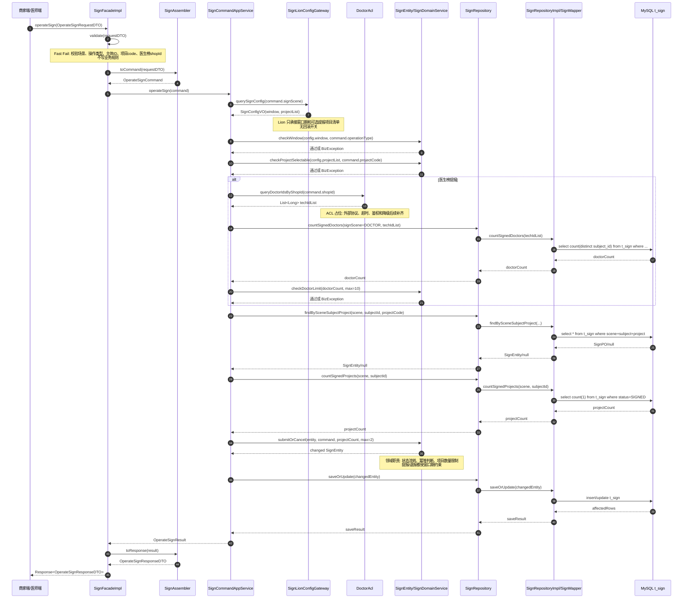
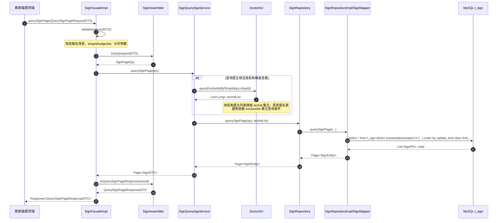
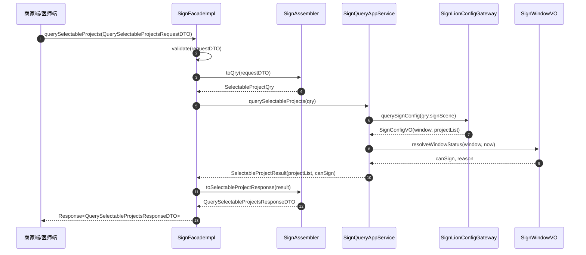
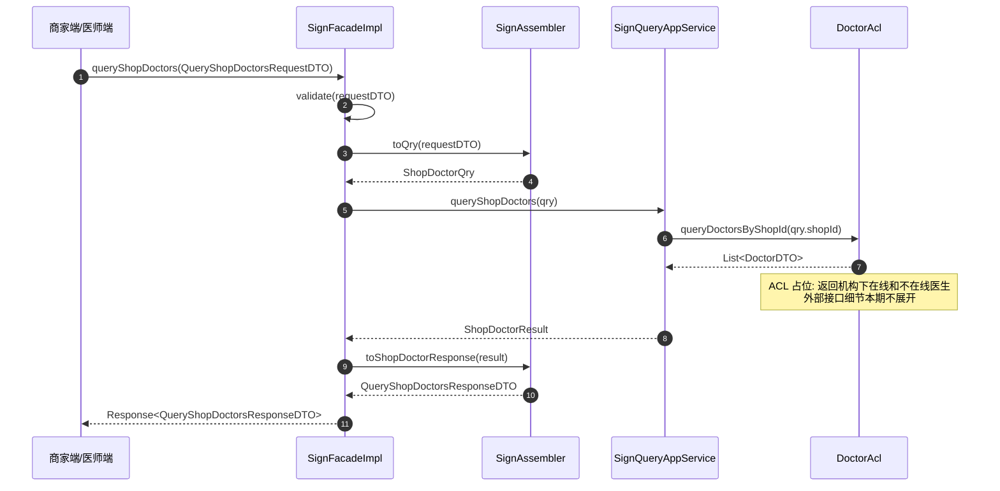
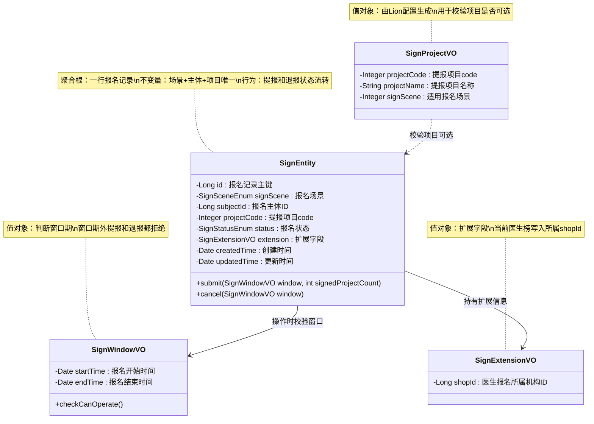
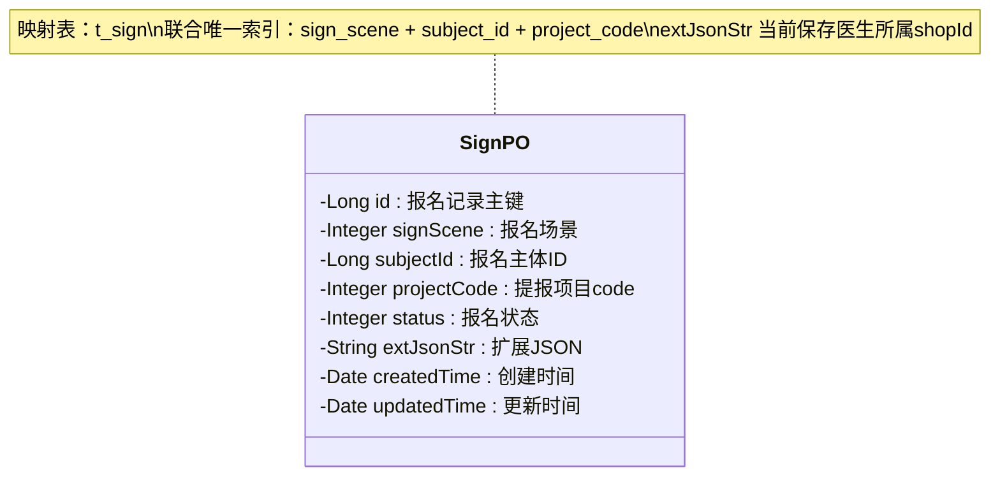

# 司南榜报名技术方案

## 0. 目标澄清

### 已确认目标

- 为司南榜提供统一报名能力，支持机构榜和医生榜。
- 支持提报、退报、报名结果分页查询、可选提报项目查询、机构下医生列表查询。
- 报名数据持久化到 MySQL，供后续筛选、材料提报和进度查看关联使用。
- 支持报名窗口期卡控；窗口期结束后不允许提报，也不允许退报。

### 已确认边界

- 本期不做评审、筛选、最终上榜、材料提报表单、材料审核流程、运营后台筛选、榜单排名和结果发布。
- 本期不做报名后进度/阶段展示。
- 本期不做报名记录跳转材料提报。
- 医生列表通过外部服务查询，本方案只设计 ACL 防腐层占位，具体外部协议、字段映射和降级策略本期先跳过。

### 已确认入口

- 当前仓库已有 `rank-api`、`rank-application`、`rank-domain`、`rank-infrastructure` 四层骨架。
- 对外契约按 `rank-api` 的 `SignFacade` 设计；当前仓库暂无独立 `adapter` 模块，方案仍按 FacadeImpl/Adapter 职责描述，落码时需按项目现有模块约定放置实现类。

### 已确认接口拆分

1. `SignFacade#operateSign`：报名操作接口，提报和退报共用。
2. `SignFacade#querySignPage`：查询报名结果分页列表。
3. `SignFacade#querySelectableProjects`：查询当前可以选择的提报项目。
4. `SignFacade#queryShopDoctors`：查询当前机构下的医生列表。

每个接口都需要独立接口文档。

### 已确认成功标准

- 商家能在窗口期内完成机构榜提报和医生榜提报。
- 医生榜报名时，一个机构最多报名 10 个医生。
- 每个报名主体最多提报 2 个项目。
- 同一个 `报名场景 + 报名主体 + 提报项目` 只存在一行记录，提报和退报通过状态字段流转表达。
- 窗口期结束后，提报和退报都被拦截。
- 用户可以分页查询机构和医生报名结果。

## 0.1 方案锚点

### 当前理解

- 司南榜报名是 `sign` 聚合的核心能力。
- 本次报名记录粒度为“主体 x 提报项目”一行。
- 主体在机构榜中表示 `shopId`，在医生榜中表示 `techId`；主体语义由报名场景区分。
- 医生榜报名的扩展字段 `extJsonStr` 需要记录医生报名时所属 `shopId`。

### 核心目标

- 用一个轻量但可扩展的报名聚合承接机构榜、医生榜提报和退报。
- 用 MySQL 唯一索引保障重复提报不会产生多行。
- 用 Lion 承接报名窗口期和可选提报项目清单。
- 用 ACL 防腐层隔离医生列表外部查询。

### 范围边界

- 包含：Facade 接口、Command/Query 编排、SignEntity 领域行为、SignRepository、SignPO/Mapper、Lion 配置读取、DoctorAcl 占位。
- 不包含：缓存、MQ、海马/Appkit、材料流程、评审流程、运营后台、真实外部医生服务协议。

### 完成标准

- 方案能指导开发完成 4 个 Facade 接口及对应 DTO。
- 方案能指导开发实现报名状态流转、窗口期卡控、项目数量限制、医生数量限制。
- 方案能指导 DBA/开发确认 `t_sign` 表结构、唯一索引和必要普通索引。
- 方案能让测试按接口和规则构造用例。

### 待确认问题

- `t_sign` 字段类型、长度、默认值、普通索引、迁移脚本和 DBA 评审结论仍待确认。
- Lion 配置 key、项目 code/name 完整清单、窗口期具体时间仍待确认。
- DoctorAcl 外部服务的真实接口、超时、失败降级和鉴权方式仍待后续方案补齐。

## 0.2 设计维度判定

| 维度 | 是否涉及 | 判断依据 | 是否展开 |
|---|---|---|---|
| DB 变更 | 是 | 用户确认使用 MySQL，表名 `t_sign` | 是 |
| 海马/Appkit 配置 | 否 | 用户确认只涉及 Lion 和 MySQL | 否 |
| Cellar / 缓存 | 否 | 用户确认只涉及 Lion 和 MySQL | 否 |
| Mafka / MQ 消息 | 否 | 本期报名同步落库，无异步消息诉求 | 否 |
| Lion 开关 / 配置 | 是 | 用户确认 Lion 承接窗口期和可选项目 | 是 |
| 灰度和回滚 | 部分涉及 | 用户确认不考虑回滚开关；仍需上线步骤 | 轻量展开 |
| 接口文档 | 是 | 用户确认 4 个接口都需要文档 | 是 |
| 外部 RPC / HTTP | 占位涉及 | 医生列表外部查询，但具体 ACL 逻辑先跳过 | 只写占位和边界 |
| 真实调用代码 | 否 | 外部医生 ACL 具体逻辑先跳过 | 否 |
| 测试用例与测试代码 | 部分涉及 | 技术方案提供测试用例；不输出完整测试代码 | 轻量展开 |
| 接口拆分 | 是 | 用户确认 4 个接口 | 是 |
| Entity 设计 | 是 | `SignEntity` 是核心聚合根 | 是 |
| MySQL 表结构用户输入 | 部分提供 | 已提供表名、核心字段、唯一索引；字段类型未完全提供 | 基于输入整理 |

## 0.3 用户输入确认

| 输入项 | 用户是否已提供 | 说明 |
|---|---|---|
| 核心目标与成功标准 | 是 | 报名、查询、项目、医生列表、窗口期 |
| 入口与调用方 | 是 | `SignFacade` |
| 接口拆分清单 | 是 | 4 个接口 |
| 每个接口的接口文档要求 | 是 | 都需要 |
| Entity/VO 设计输入 | 是 | 主体、场景、项目、状态、扩展字段 |
| MySQL 表结构 | 部分提供 | 表名和关键字段已给，精确类型和普通索引待确认 |
| 中间件与外部依赖 | 是 | Lion、MySQL、DoctorAcl 占位 |
| 测试、灰度、回滚要求 | 部分提供 | 不考虑回滚开关；测试用例由方案给出 |

## 1. 背景与目标

### 1.1 业务背景

司南榜需要在榜单开始前收集机构和医生的报名意向。用户需要知道自己机构及机构下医生已报名哪些项目，并可以在窗口期内完成提报或退报。

### 1.2 本次目标

- 支持机构榜报名，报名主体为 `shopId`。
- 支持医生榜报名，报名主体为 `techId`，扩展字段记录所属 `shopId`。
- 支持同一个报名接口完成提报和退报。
- 支持分页查询报名结果。
- 支持查询当前报名场景可选提报项目。
- 支持查询当前机构下医生列表。

### 1.3 非目标

- 不做材料提报表单和材料审核。
- 不做评审、打分、榜单发布。
- 不做运营后台筛选。
- 不做 MQ、缓存、海马/Appkit。
- 不展开外部医生服务真实调用细节。

### 1.4 上下游

- 上游：商家端/医师端页面或 BFF，调用 `SignFacade`。
- 下游：MySQL `t_sign`、Lion 报名配置、DoctorAcl 外部医生查询占位。

## 2. 调用链与分层职责

### 2.1 报名/退报调用链



### 2.2 查询报名结果分页列表调用链



### 2.3 查询可选提报项目调用链



### 2.4 查询机构下医生列表调用链



## 3. 领域模型

### 3.1 核心对象

- `SignEntity`：报名聚合根，维护一个主体在一个报名场景下对一个提报项目的报名状态。
- `SignSceneEnum`：报名场景，区分机构榜和医生榜。
- `SignStatusEnum`：报名状态，区分已提报和已退报。
- `SignOperationEnum`：操作类型，区分提报和退报。
- `SignWindowVO`：报名窗口期值对象，负责判断当前时间是否允许操作。
- `SignExtensionVO`：扩展字段值对象，当前用于医生榜记录所属 `shopId`。
- `SignProjectVO`：提报项目值对象，由 Lion 配置生成，`projectCode` 为 int。

### 3.2 Java 代码示意

```java
/**
 * 聚合职责：维护报名主体在某个报名场景下对单个提报项目的报名状态。
 * 核心不变量：
 * 1. 一个报名记录只对应一个场景、一个主体、一个提报项目。
 * 2. 提报和退报必须发生在报名窗口期内。
 * 3. 同一主体最多保持 2 个已提报项目。
 */
@Getter
public class SignEntity {
    private Long id; // 报名记录主键
    private SignSceneEnum signScene; // 报名场景：机构榜或医生榜
    private Long subjectId; // 报名主体ID：机构榜为shopId，医生榜为techId
    private Integer projectCode; // 提报项目code
    private SignStatusEnum status; // 报名状态：已提报或已退报
    private SignExtensionVO extension; // 扩展字段，医生榜记录所属shopId
    private Date createdTime; // 创建时间
    private Date updatedTime; // 更新时间

    /**
     * @param window 报名窗口期
     * @param signedProjectCount 当前主体已提报项目数量
     * @return 无返回值；副作用：将状态流转为已提报
     */
    public void submit(SignWindowVO window, int signedProjectCount) {
        window.checkCanOperate();
        if (SignStatusEnum.SIGNED.equals(this.status)) {
            return;
        }
        if (signedProjectCount >= 2) {
            throw new BizException("报名主体最多提报2个项目");
        }
        this.status = SignStatusEnum.SIGNED;
        this.updatedTime = new Date();
    }

    /**
     * @param window 报名窗口期
     * @return 无返回值；副作用：将状态流转为已退报
     */
    public void cancel(SignWindowVO window) {
        window.checkCanOperate();
        if (SignStatusEnum.CANCELLED.equals(this.status)) {
            return;
        }
        this.status = SignStatusEnum.CANCELLED;
        this.updatedTime = new Date();
    }
}
```

```java
/**
 * 值对象职责：封装报名窗口期判断。
 * 核心不变量：开始时间和结束时间必须同时存在，且开始时间早于结束时间。
 */
@Getter
@RequiredArgsConstructor
public class SignWindowVO {
    private final Date startTime; // 报名开始时间
    private final Date endTime; // 报名结束时间

    /**
     * @return 无返回值；副作用：窗口期外抛出业务异常
     */
    public void checkCanOperate() {
        Date now = new Date();
        if (now.before(startTime) || now.after(endTime)) {
            throw new BizException("当前不在报名窗口期内，不能提报或退报");
        }
    }
}
```

```java
/**
 * 值对象职责：承载报名扩展字段。
 * 核心不变量：医生榜报名必须记录所属shopId。
 */
@Getter
@RequiredArgsConstructor
public class SignExtensionVO {
    private final Long shopId; // 医生报名时所属机构ID
}
```

### 3.3 Mermaid 类图



## 4. 持久化模型

### 4.1 PO 设计

`t_sign` 表结构由用户提供核心字段，本方案只基于已确认输入整理持久化模型。字段精确类型、长度、默认值和普通索引仍需 DBA 确认。

```java
@Data
public class SignPO {
    private Long id; // 报名记录主键
    private Integer signScene; // 报名场景：机构榜或医生榜
    private Long subjectId; // 报名主体ID：机构榜为shopId，医生榜为techId
    private Integer projectCode; // 提报项目code
    private Integer status; // 报名状态：提报或退报
    private String extJsonStr; // 扩展JSON，医生榜记录所属shopId
    private Date createdTime; // 创建时间
    private Date updatedTime; // 更新时间
}
```

### 4.2 PO Mermaid 图



### 4.3 Repository 访问模式

```java
public interface SignRepository {
    SignEntity findBySceneSubjectProject(Integer signScene, Long subjectId, Integer projectCode);

    int countSignedProjects(Integer signScene, Long subjectId);

    int countSignedDoctors(Integer signScene, List<Long> techIdList);

    void saveOrUpdate(SignEntity signEntity);

    PageResult<SignEntity> querySignPage(SignPageQry qry, List<Long> techIdList);
}
```

## 5. DB 变更

### 5.1 已确认表

| 表名 | 用途 |
|---|---|
| `t_sign` | 存储司南榜机构榜/医生榜报名记录 |

### 5.2 已确认字段语义

| 字段 | 类型 | 说明 | 确认状态 |
|---|---|---|---|
| `id` | TBD | 报名记录主键 | 待确认 |
| `sign_scene` | TBD | 报名场景，区分机构榜/医生榜 | 已确认语义 |
| `subject_id` | TBD | 报名主体，机构榜为 `shopId`，医生榜为 `techId` | 已确认语义 |
| `project_code` | INT | 提报项目 | 已确认 |
| `ext_json_str` | TBD | 扩展字段 JSONStr，医生榜保存所属 `shopId` | 已确认语义 |
| `status` | TBD | 状态字段，表示提报/退报 | 已确认语义 |
| `created_time` | TBD | 创建时间 | 建议字段 |
| `updated_time` | TBD | 更新时间 | 建议字段 |

### 5.3 已确认唯一约束

| 索引名 | 类型 | 字段 | 业务约束 |
|---|---|---|---|
| `uk_scene_subject_project` | 联合唯一索引 | `sign_scene, subject_id, project_code` | 同一个报名场景下，同一主体对同一提报项目只能有一行记录 |

### 5.4 普通索引待评审

用户已确认唯一索引，但分页查询和医生榜机构维度查询仍需要 DBA 评估普通索引：

- `idx_scene_subject_status_update_time`：支撑按场景、主体、状态分页查询。
- `idx_scene_status_subject`：支撑医生榜通过 `techIdList` 查询报名记录和统计已报名医生数。

风险：如果未来要求直接按 `ext_json_str.shopId` 查询医生榜报名记录，JSON 字段不适合做主查询条件。当前方案通过 DoctorAcl 先查机构下 `techIdList`，再按 `subject_id in (...)` 查 `t_sign`，避免依赖 JSON 查询。

### 5.5 状态建议

| 状态 | code | 说明 |
|---|---:|---|
| 已提报 | 1 | 当前主体已报名该项目 |
| 已退报 | 2 | 当前主体已退报该项目，记录保留 |

状态 code 需要在落库前由研发/DBA 最终确认。

## 6. Lion 配置设计

### 6.1 配置用途

Lion 只承接：

- 报名窗口期。
- 各报名场景可选提报项目清单。

不承接：

- 回滚开关。
- 灰度开关。
- 缓存配置。
- 医生列表外部服务配置。

### 6.2 配置结构建议

Lion key 待确认，方案中先使用 `rank.sign.config` 作为占位。

```json
{
  "startTime": "2026-07-01 00:00:00",
  "endTime": "2026-07-31 23:59:59",
  "sceneProjects": {
    "1": [
      {
        "projectCode": 101,
        "projectName": "种植牙"
      },
      {
        "projectCode": 102,
        "projectName": "矫正"
      }
    ],
    "2": [
      {
        "projectCode": 101,
        "projectName": "种植牙"
      },
      {
        "projectCode": 103,
        "projectName": "儿牙"
      }
    ]
  }
}
```

### 6.3 读取与失败处理

- `querySelectableProjects`：Lion 配置读取失败时，返回空项目列表，`canSign=false`，提示“报名配置暂不可用”。
- `operateSign`：Lion 配置读取失败、窗口期缺失、项目清单缺失时，按 fail closed 处理，拒绝提报/退报，避免错误开放报名。
- 配置解析异常必须打 ERROR 日志并带异常对象。

## 7. 缓存设计

不涉及。

依据：用户确认本次只涉及 Lion 和 MySQL；报名量级 3500 商户、每主体最多 2 个项目、每机构最多 10 个医生，当前不需要引入 Cellar/缓存承接查询压力。

## 8. MQ 设计

不涉及。

依据：本期报名、退报和查询均为同步链路，没有异步通知、削峰、补偿或事件订阅诉求。

## 9. 接口文档

### 9.1 文档级信息

| 项目 | 内容 |
|---|---|
| package / module | `rank-api` |
| Facade class | `com.rank.api.sign.facade.SignFacade` |
| 统一响应体 | `Response<T>`，当前仓库未提供基类，落码时按项目统一响应实现 |
| 共享鉴权规则 | 待补充；本方案默认由调用方/BFF 已完成登录态和权限校验 |
| 网关 Path | 不涉及；按 Facade 接口设计 |

### 9.2 接口一：报名操作

#### 基本信息

| 项目 | 内容 |
|---|---|
| 方法名 | `SignFacade#operateSign` |
| 接口描述 | 提报和退报共用接口 |
| 网关 Path | N/A |
| 是否区分端 | 待补充；商家端/医师端共用时通过鉴权上下文区分 |
| 是否需要鉴权 | 是；方式待补充 |
| 异常返回 | 参数非法、窗口期外、项目不可选、超过项目数限制、超过医生数限制 |

#### 入参字段

| 字段名 | 类型 | 是否必填 | 说明 |
|---|---|---|---|
| `signScene` | Integer | 是 | 报名场景：1 机构榜，2 医生榜 |
| `operationType` | Integer | 是 | 操作类型：1 提报，2 退报 |
| `subjectId` | Long | 是 | 报名主体ID：机构榜为 `shopId`，医生榜为 `techId` |
| `projectCode` | Integer | 是 | 提报项目 code |
| `shopId` | Long | 医生榜必填 | 医生榜报名时所属机构ID，写入 `extJsonStr` |
| `operatorId` | Long | 否 | 操作人ID，审计字段，当前表结构未确认是否落库 |

#### 入参 JSON

```json
{
  "signScene": 2,
  "operationType": 1,
  "subjectId": 900001,
  "projectCode": 101,
  "shopId": 123456,
  "operatorId": 777
}
```

#### 返回值字段

| 字段名 | 类型 | 说明 |
|---|---|---|
| `code` | Integer | 响应码，200 表示成功 |
| `msg` | String | 响应描述 |
| `data.signId` | Long | 报名记录ID |
| `data.signScene` | Integer | 报名场景 |
| `data.subjectId` | Long | 报名主体ID |
| `data.projectCode` | Integer | 提报项目 code |
| `data.status` | Integer | 当前状态 |
| `traceId` | String | 链路 traceId |

#### 返回 JSON

```json
{
  "code": 200,
  "msg": "success",
  "data": {
    "signId": 10001,
    "signScene": 2,
    "subjectId": 900001,
    "projectCode": 101,
    "status": 1
  },
  "traceId": "0a1b2c3d4e5f"
}
```

#### 失败 JSON

```json
{
  "code": 400001,
  "msg": "当前不在报名窗口期内，不能提报或退报",
  "data": null,
  "traceId": "0a1b2c3d4e5f"
}
```

### 9.3 接口二：查询报名结果分页列表

#### 基本信息

| 项目 | 内容 |
|---|---|
| 方法名 | `SignFacade#querySignPage` |
| 接口描述 | 分页查询机构榜或医生榜报名记录 |
| 网关 Path | N/A |
| 是否区分端 | 待补充 |
| 是否需要鉴权 | 是；方式待补充 |
| 异常返回 | 参数非法、医生 ACL 查询失败 |

#### 入参字段

| 字段名 | 类型 | 是否必填 | 说明 |
|---|---|---|---|
| `signScene` | Integer | 是 | 报名场景 |
| `shopId` | Long | 否 | 按机构维度查询时传入；医生榜查询机构下医生报名记录时必填 |
| `subjectId` | Long | 否 | 精确查询某个主体时传入 |
| `status` | Integer | 否 | 报名状态，不传查全部 |
| `pageNo` | Integer | 是 | 页码，从 1 开始 |
| `pageSize` | Integer | 是 | 每页大小 |

#### 入参 JSON

```json
{
  "signScene": 2,
  "shopId": 123456,
  "status": 1,
  "pageNo": 1,
  "pageSize": 20
}
```

#### 返回值字段

| 字段名 | 类型 | 说明 |
|---|---|---|
| `data.total` | Long | 总条数 |
| `data.pageNo` | Integer | 当前页 |
| `data.pageSize` | Integer | 每页大小 |
| `data.records[].signId` | Long | 报名记录ID |
| `data.records[].signScene` | Integer | 报名场景 |
| `data.records[].subjectId` | Long | 报名主体ID |
| `data.records[].projectCode` | Integer | 提报项目 code |
| `data.records[].projectName` | String | 提报项目名称，来自 Lion 项目配置 |
| `data.records[].status` | Integer | 报名状态 |
| `data.records[].extJsonStr` | String | 扩展字段 JSON |

#### 返回 JSON

```json
{
  "code": 200,
  "msg": "success",
  "data": {
    "total": 1,
    "pageNo": 1,
    "pageSize": 20,
    "records": [
      {
        "signId": 10001,
        "signScene": 2,
        "subjectId": 900001,
        "projectCode": 101,
        "projectName": "种植牙",
        "status": 1,
        "extJsonStr": "{\"shopId\":123456}"
      }
    ]
  },
  "traceId": "0a1b2c3d4e5f"
}
```

#### 失败 JSON

```json
{
  "code": 400002,
  "msg": "查询报名记录失败",
  "data": null,
  "traceId": "0a1b2c3d4e5f"
}
```

### 9.4 接口三：查询当前可以选择的提报项目

#### 基本信息

| 项目 | 内容 |
|---|---|
| 方法名 | `SignFacade#querySelectableProjects` |
| 接口描述 | 查询当前报名场景可选择的提报项目和窗口期状态 |
| 网关 Path | N/A |
| 是否区分端 | 待补充 |
| 是否需要鉴权 | 是；方式待补充 |
| 异常返回 | 参数非法、Lion 配置不可用 |

#### 入参字段

| 字段名 | 类型 | 是否必填 | 说明 |
|---|---|---|---|
| `signScene` | Integer | 是 | 报名场景 |
| `subjectId` | Long | 否 | 报名主体ID，用于后续按主体过滤时扩展 |

#### 入参 JSON

```json
{
  "signScene": 1,
  "subjectId": 123456
}
```

#### 返回值字段

| 字段名 | 类型 | 说明 |
|---|---|---|
| `data.canSign` | Boolean | 当前是否在窗口期内 |
| `data.reason` | String | 不可报名原因 |
| `data.startTime` | String | 报名开始时间 |
| `data.endTime` | String | 报名结束时间 |
| `data.projects[].projectCode` | Integer | 提报项目 code |
| `data.projects[].projectName` | String | 提报项目名称 |

#### 返回 JSON

```json
{
  "code": 200,
  "msg": "success",
  "data": {
    "canSign": true,
    "reason": "",
    "startTime": "2026-07-01 00:00:00",
    "endTime": "2026-07-31 23:59:59",
    "projects": [
      {
        "projectCode": 101,
        "projectName": "种植牙"
      }
    ]
  },
  "traceId": "0a1b2c3d4e5f"
}
```

#### 失败 JSON

```json
{
  "code": 400003,
  "msg": "报名配置暂不可用",
  "data": {
    "canSign": false,
    "reason": "报名配置暂不可用",
    "projects": []
  },
  "traceId": "0a1b2c3d4e5f"
}
```

### 9.5 接口四：查询当前机构下的医生列表

#### 基本信息

| 项目 | 内容 |
|---|---|
| 方法名 | `SignFacade#queryShopDoctors` |
| 接口描述 | 查询当前机构下可用于医生榜报名的医生列表 |
| 网关 Path | N/A |
| 是否区分端 | 待补充 |
| 是否需要鉴权 | 是；方式待补充 |
| 异常返回 | 参数非法、外部医生 ACL 查询失败 |

#### 入参字段

| 字段名 | 类型 | 是否必填 | 说明 |
|---|---|---|---|
| `shopId` | Long | 是 | 机构ID |
| `includeOffline` | Boolean | 否 | 是否包含不在线医生，默认 true |

#### 入参 JSON

```json
{
  "shopId": 123456,
  "includeOffline": true
}
```

#### 返回值字段

| 字段名 | 类型 | 说明 |
|---|---|---|
| `data.doctors[].techId` | Long | 医生ID |
| `data.doctors[].doctorName` | String | 医生名称 |
| `data.doctors[].onlineStatus` | Integer | 在线状态 |
| `data.doctors[].shopId` | Long | 所属机构ID |

#### 返回 JSON

```json
{
  "code": 200,
  "msg": "success",
  "data": {
    "doctors": [
      {
        "techId": 900001,
        "doctorName": "张医生",
        "onlineStatus": 1,
        "shopId": 123456
      }
    ]
  },
  "traceId": "0a1b2c3d4e5f"
}
```

#### 失败 JSON

```json
{
  "code": 400004,
  "msg": "查询机构医生列表失败",
  "data": null,
  "traceId": "0a1b2c3d4e5f"
}
```

## 10. 测试用例与验证代码

本期提供测试用例，不输出完整测试代码。依据：用户确认只涉及 Lion 和 MySQL，外部医生 ACL 具体逻辑先跳过。

| 用例 | 场景 | 入参 | 前置数据 / Mock | 预期返回值 | 预期副作用 |
|---|---|---|---|---|---|
| TC-001 | 机构榜提报成功 | `signScene=1, operationType=1, subjectId=shopId, projectCode=101` | Lion 窗口期内，项目 101 可选，DB 无记录 | `code=200,status=1` | `t_sign` 插入一行 |
| TC-002 | 医生榜提报成功 | `signScene=2, operationType=1, subjectId=techId, shopId=shopId, projectCode=101` | DoctorAcl 返回 techId 属于 shopId，未超过 10 个医生，未超过 2 个项目 | `code=200,status=1` | `t_sign` 插入/更新一行，`extJsonStr` 包含 shopId |
| TC-003 | 重复提报幂等 | 同 TC-001 | DB 已有 `status=1` 记录 | `code=200,status=1` | 不新增行 |
| TC-004 | 退报成功 | `operationType=2` | DB 已有 `status=1` 记录，Lion 窗口期内 | `code=200,status=2` | 原记录更新为退报 |
| TC-005 | 窗口期后提报失败 | `operationType=1` | Lion 当前时间晚于 `endTime` | 业务失败，提示窗口期外 | DB 无写入 |
| TC-006 | 窗口期后退报失败 | `operationType=2` | Lion 当前时间晚于 `endTime` | 业务失败，提示窗口期外 | DB 无写入 |
| TC-007 | 超过项目数限制 | 同一主体提报第 3 个项目 | DB 已有 2 个 `status=1` 项目 | 业务失败，提示最多提报 2 个项目 | DB 无写入 |
| TC-008 | 超过医生数限制 | 医生榜第 11 个医生提报 | DoctorAcl 返回机构医生列表，DB 已有 10 个不同医生 `status=1` | 业务失败，提示机构最多报名 10 个医生 | DB 无写入 |
| TC-009 | 查询报名分页 | `signScene=2, shopId=123456, pageNo=1, pageSize=20` | DoctorAcl 返回 techIdList，DB 有报名记录 | 返回分页列表 | 无写入 |
| TC-010 | Lion 配置不可用 | 查询项目或提报 | Lion 返回空或解析异常 | 查询项目返回 `canSign=false`；提报失败 | 无写入，ERROR 日志 |
| TC-011 | DoctorAcl 查询失败 | 查询医生列表或医生榜查询 | DoctorAcl 抛异常 | 失败 Response | 无写入，ERROR 日志 |

## 11. 灰度

### 11.1 上线策略

- 本期不设计独立回滚开关。
- 先上线代码和 MySQL 表结构，再配置 Lion 窗口期和项目清单。
- Lion 未配置或配置异常时，提报/退报 fail closed，避免误开放报名。

### 11.2 观察指标

- `operateSign` 成功量、失败量、失败原因分布。
- `querySignPage` RT 和错误量。
- Lion 配置解析失败次数。
- DoctorAcl 查询失败次数。
- MySQL 唯一键冲突次数。

### 11.3 回滚说明

- 用户确认不考虑回滚开关。
- 代码回滚走应用发布平台标准回滚。
- Lion 可将窗口期置为已结束，用于立即阻断新提报和退报，但这不是功能回滚开关。
- `t_sign` 数据为业务事实数据，回滚代码时不做自动删除。

## 12. 方案质量自检

| 检查项 | 结论 | 说明 |
|---|---|---|
| 目标与边界 | PASS | 已确认本期做报名链路，不做材料、评审、进度 |
| 调用链理解 | PASS | 4 个接口均有时序图 |
| 模型表达 | PASS | 已定义 `SignEntity`、窗口期 VO、扩展 VO |
| 数据与索引 | RISK | 表名和唯一索引已确认；字段类型、普通索引、DDL 待 DBA 确认 |
| Lion 配置 | PASS | 已明确窗口期和项目清单，失败 fail closed |
| 缓存取舍 | N/A | 用户确认不涉及缓存 |
| MQ 语义 | N/A | 用户确认不涉及 MQ |
| 外部调用 | RISK | 医生列表外部查询只做 ACL 占位，真实协议待补齐 |
| 测试验证 | PASS | 已覆盖正常、参数/窗口、幂等、限制、配置失败、ACL 失败 |
| 灰度与回滚 | PASS | 不设计回滚开关，保留上线阻断策略和观察指标 |

